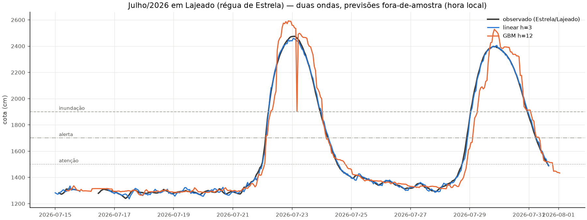

# Estudo de caso — as duas cheias de julho/2026 em Lajeado

As duas ondas de julho/2026 (picos nas madrugadas/tardes de quarta 22/07 e
29/07) entraram na validação cruzada como fold: as previsões abaixo vêm de
modelos que **nunca viram este evento no treino**. Lajeado é lido pela régua
de Estrela (86879300), como na prática do SACE. Cotas de referência:
atenção 1.500 / alerta 1.700 / inundação 1.900 cm.

## Previsto × ocorrido

| Onda | Modelo | Pico obs (cm) | Pico previsto | Erro pico | Erro tempo | Atraso aviso inundação | MAE evento |
|---|---|---|---|---|---|---|---|
| 21–23/07 | **linear h=3** | 2.475 | 2.459 | **−16** | −1h | 1h | 13 cm |
| 21–23/07 | linear h=6 | 2.475 | 2.451 | −24 | −6h | 1h | 29 cm |
| 21–23/07 | GBM h=6 | 2.475 | 2.574 | +99 | −8h | 1h | 47 cm |
| 21–23/07 | GBM h=12 | 2.475 | 2.592 | +117 | −5h | 2h | 61 cm |
| 28–30/07 | **linear h=3** | 2.398 | 2.405 | **+7** | +3h | 0h | 12 cm |
| 28–30/07 | linear h=6 | 2.398 | 2.399 | **+1** | +3h | 1h | 29 cm |
| 28–30/07 | GBM h=6 | 2.398 | 2.486 | +88 | −1h | 3h | 54 cm |
| 28–30/07 | GBM h=12 | 2.398 | 2.528 | +130 | +1h | 6h | 77 cm |

## Leitura

- **O linear cravou os picos** (−16 e +7 cm em h=3; +1 cm em h=6 na 2ª onda) e
  a trajetória prevista cruzou a cota de inundação com 0–1h de atraso — na
  prática, aviso de 3–6h de antecedência com valor quase exato.
- **O GBM superestimou (+88 a +130 cm)** — o oposto dos eventos recordes de
  2023/24 (onde subestima). Estes picos estão dentro do envelope de treino
  (Estrela já viu 3.366 cm), então a árvore funciona, com viés para cima —
  erro do lado seguro para aviso de 12h, mas custa credibilidade.
- **Cenário ideal**: magnitude já vista, sensores funcionando (144 e 113
  horas válidas, sem a censura de 2024). É o caso em que a antecedência de
  12h existe de verdade.
- O espigão com queda abrupta na curva GBM h=12 em 23/07 é artefato de uma
  hora com feature de chuva faltante (lacuna do MERGE recente) — visível em
  vez de suavizado, por política do projeto.
