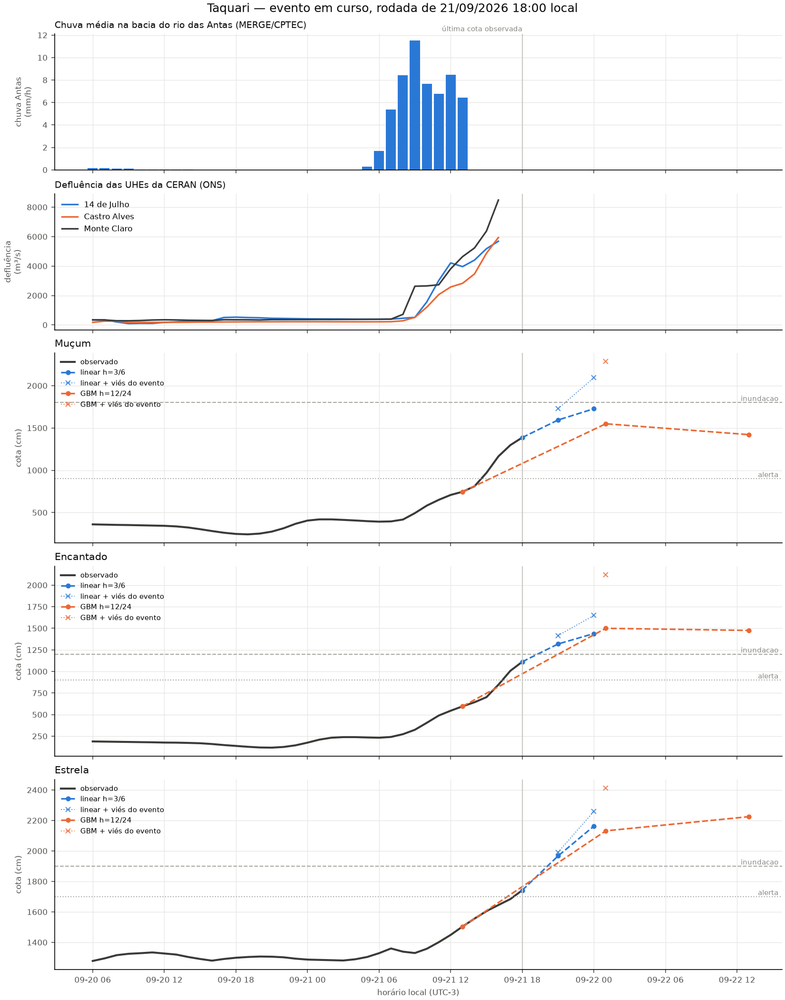

# Evento de 21/09/2026 — estimativa durante a cheia (rodada 18:00 local)

> **Esta página não é um alerta.** É o registro público de uma rodada do modelo
> feita *durante* um evento, com os erros medidos na hora. Ela existe para ser
> conferida depois contra o que de fato aconteceu. Para decisão operacional:
> [SACE/SGB](https://www.sgb.gov.br/sace/) e Defesa Civil do RS (199).

Primeira rodada em tempo real deste projeto (`src/live/`). Todas as fases
anteriores são retrospectivas: reconstroem o passado com rótulo conhecido.
Os alvos futuros desta rodada ainda não foram observados. A aferição abaixo
é um replay das horas anteriores, não um arquivo de previsões emitidas nelas.

**Revisão metodológica:** os números da rodada original foram preservados.
A revisão de 6/9/12h, com latência por fonte no treino e na inferência, está em
[validação cronológica](11_validacao_live.md). A conclusão anterior de um
"teto útil de 6h" não era sustentada por um critério de erro aceitável.

## Situação às 18:00 local (21:00 UTC)

Cinco estações do Taquari em alerta; nenhuma acima da cota de inundação ainda.

| Estação | Cota | Situação | Falta p/ inundação |
|---|---|---|---|
| Linha José Julio | 1528 cm | alerta | 922 cm |
| Santa Tereza | 1242 cm | alerta | 258 cm |
| Muçum | 1387 cm | alerta | 413 cm |
| Encantado | 1112 cm | alerta | **88 cm** |
| Estrela (ref. Lajeado) | 1742 cm | alerta | **158 cm** |
| Porto Mariante | 931 cm | atenção | 469 cm |
| Taquari | 460 cm | atenção | 390 cm |

Muçum subiu de **392 cm às 06:00 para 1387 cm às 18:00** — ~10 m em 12 horas.

## Latência por fonte — o que decide o horizonte utilizável

O achado operacional desta rodada não é uma previsão, é uma tabela de relógios.
Cada fonte tem uma defasagem diferente, e ela define em qual horizonte cada
modelo pode ser rodado:

| Fonte | Variáveis | Defasagem | Última observação |
|---|---|---|---|
| ANA SOAP | cota, chuva de posto | ~15 min | 21:00 UTC |
| ONS (CKAN) | defluência das UHEs CERAN | ~1 h | 20:00 UTC |
| MERGE/CPTEC | chuva em grade | **~5 h** | 16:00 UTC |

Consequência direta: o modelo linear (só lags de cota) roda em `t = 21:00 UTC`;
o GBM, que depende dos acumulados de chuva, roda em `t = 16:00 UTC` — **cinco
horas cego**, justamente as cinco horas em que Muçum subiu 640 cm. Nenhum
relatório anterior mediu isso, porque em modo retrospectivo todas as fontes
parecem igualmente disponíveis. Não parecem.

## Previsões emitidas

Modelo por horizonte conforme o veredito da Fase 7: linear em h≤6, GBM em h≥12.

| Alvo | t de ref. | h | Bruto | Viés medido no evento | Corrigido | Inundação |
|---|---|---|---|---|---|---|
| Muçum | 18:00 | 3 | 1594 | −134 (n=9) | 1728 | 1800 |
| Muçum | 18:00 | 6 | 1727 | −367 (n=6) | 2095 | 1800 |
| Muçum | 13:00 | 12 | 1550 | −739 (n=5) | 2288 | 1800 |
| Muçum | 13:00 | 24 | 1421 | — sem amostra — | — | 1800 |
| Encantado | 18:00 | 3 | **1318** | −98 (n=9) | 1416 | 1200 |
| Encantado | 18:00 | 6 | **1439** | −210 (n=6) | 1649 | 1200 |
| Encantado | 13:00 | 12 | **1500** | −622 (n=5) | 2122 | 1200 |
| Encantado | 13:00 | 24 | **1475** | — sem amostra — | — | 1200 |
| Estrela | 18:00 | 3 | **1967** | −24 (n=9) | 1991 | 1900 |
| Estrela | 18:00 | 6 | **2163** | −97 (n=6) | 2260 | 1900 |
| Estrela | 13:00 | 12 | **2132** | −281 (n=5) | 2413 | 1900 |
| Estrela | 13:00 | 24 | **2225** | — sem amostra — | — | 1900 |

Em negrito, os valores que cruzam a cota de inundação já no número bruto.

Horários de validade, em UTC−3: linear h=3 → 21/09 21h; linear h=6 →
22/09 00h; GBM h=12 → 22/09 01h; GBM h=24 → 22/09 13h.
Assim, às 18h, o GBM tinha **7h e 19h de antecedência nominal restante**,
respectivamente. O atraso entre a observação e a emissão reduz esses tempos.

## Replay retrospectivo das horas anteriores

O código recalculou previsões para referências anteriores usando o cache
disponível nesta rodada. O treino termina em julho/2026 e não inclui setembro,
mas a disponibilidade histórica de cada fonte não foi reconstruída. Logo,
esta tabela mede erro retrospectivo no evento; não comprova o desempenho de
previsões realmente emitidas nos horários indicados.

| Alvo | Modelo | h | MAE | Viés | n |
|---|---|---|---|---|---|
| Estrela | linear | 3 | 40 cm | −24 | 9 |
| Estrela | linear | 6 | 97 cm | −97 | 6 |
| Estrela | GBM | 12 | 281 cm | −281 | 5 |
| Encantado | linear | 3 | 114 cm | −98 | 9 |
| Encantado | linear | 6 | 210 cm | −210 | 6 |
| Encantado | GBM | 12 | 622 cm | −622 | 5 |
| Muçum | linear | 3 | 134 cm | −134 | 9 |
| Muçum | linear | 6 | 367 cm | −367 | 6 |
| Muçum | GBM | 12 | 739 cm | −739 | 5 |

**55 dos 60 pares (91,7%) subestimam a observação.** Há cinco erros positivos:
dois em Encantado e três em Estrela, todos em h=3. O viés médio é negativo em
todos os grupos; MAE = |viés| em sete das nove linhas. A subida rara é uma
hipótese para o erro, não uma causa isolada: sua taxa está nos percentis
99,98% (Muçum) e 99,996% (Encantado) do dataset de treino:

| Alvo | Subida máx. 1h no treino | p99,9 do treino | Pico observado hoje |
|---|---|---|---|
| Muçum | 421 cm/h | 117 cm/h | 195 cm/h |
| Encantado | 171 cm/h | 97 cm/h | **161 cm/h** |

Encantado está a 6% do recorde histórico de velocidade de subida da própria
série. Modelo nenhum extrapola bem onde quase não teve amostra.

## Por que o h=24 desta rodada não deve ser usado

O número existe (Muçum 1421, Encantado 1475, Estrela 2225 cm para 13:00 de
22/09), mas esta rodada não demonstra sua qualidade pelos seguintes motivos:

1. **Zero amostras na janela escolhida.** O código original seleciona as
   últimas 12 linhas completas, e nenhuma permite conferir h=24 nesta
   rodada. Isso é também uma limitação do recorte, não uma impossibilidade
   geral de avaliar h=24 durante um evento.
2. **O horizonte de 12h tem erro elevado.** Ele apresenta viés de −622 a
   −739 cm em Encantado e Muçum. São ajustes separados por horizonte;
   esse erro não mede diretamente o erro do h=24.
3. **A trajetória precisa de verificação.** Muçum cai de 1550 cm em h=12
   para 1421 cm em h=24. Dois pontos não localizam o pico nem provam
   incoerência física. Afluência superior à defluência em uma hora também
   não basta para determinar a evolução futura da vazão de saída.

Latência, entradas de cota antigas e escassez de exemplos de subida rápida
são hipóteses para a falha. Esta rodada não separa seus efeitos. As taxas
de subida citadas são raras, mas ainda estão dentro dos máximos de treino.

**Esta rodada não demonstra qualidade suficiente em h=24**, e sua referência
atrasada oferece só 19h nominais a partir das 18h. Também não demonstra que
6h seja um teto: é necessário avaliar 6/9/12h com cotas recentes, atrasos
reproduzidos no treino e critérios explícitos de erro.

## Dados de barragem

Sim, e desta vez funcionaram. As três UHEs da CERAN transmitiram sem falha:

| UHE | Defluência 06:00 | Defluência 17:00 | Fator |
|---|---|---|---|
| Monte Claro | ~250 m³/s | 8487 m³/s | 34× |
| Castro Alves | ~200 m³/s | 5940 m³/s | 30× |
| 14 de Julho | 391 m³/s | 5687 m³/s | 14,5× |

Contraste com maio/2024, quando essas mesmas usinas transmitiram 9 de 72 horas
no auge. A disponibilidade do dado de barragem, que o projeto trata como
feature e como métrica, hoje está em 100%.

## Limitações desta rodada

- Rodada única, sem redundância, sem validação operacional, feita por uma
  pessoa durante o evento.
- O viés aplicado é aritmética sobre 5–9 amostras, **não um modelo**. Serve
  para dimensionar o erro sistemático, não para substituir a previsão.
- Sem chuva prevista, falta informação sobre a precipitação futura. Os
  resultados deste projeto não estabelecem um teto físico universal de
  antecedência por estação.
- As cotas de referência vêm do boletim SACE de 28/07/2026 e podem estar
  desatualizadas.

Esta página preserva a rodada original. A versão revisada está em
[replay da rodada](live_ultima_rodada.md). Para executar a versão atual com
cache: `uv run python -m src.live.run --sem-atualizar`. Sem essa opção, a
execução atualiza ANA/ONS, baixa o MERGE recente e reprocessa o cache.
