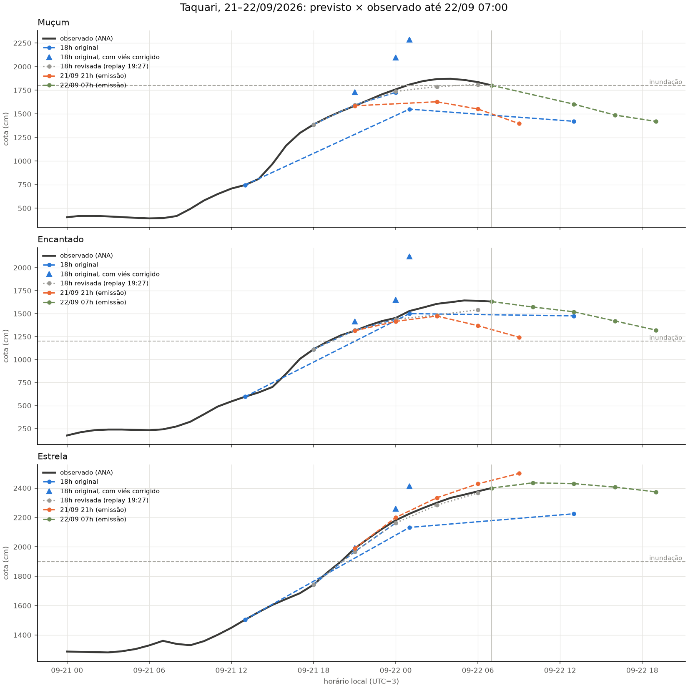
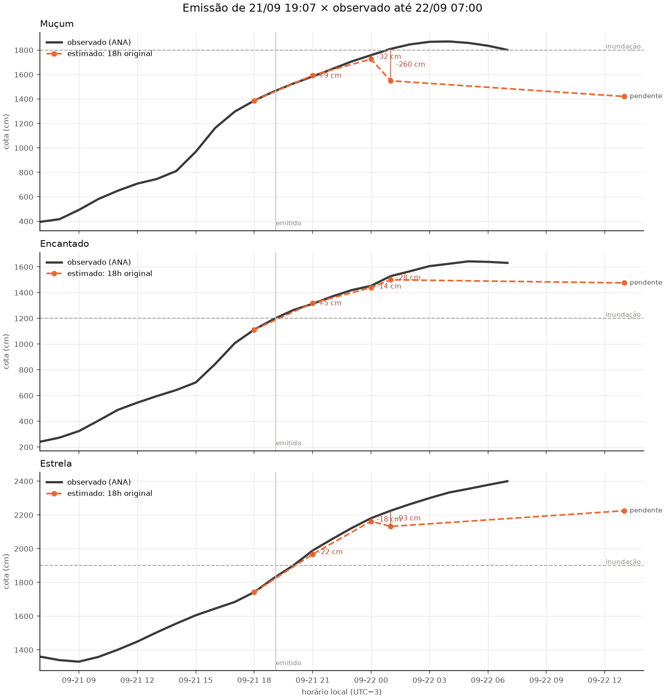
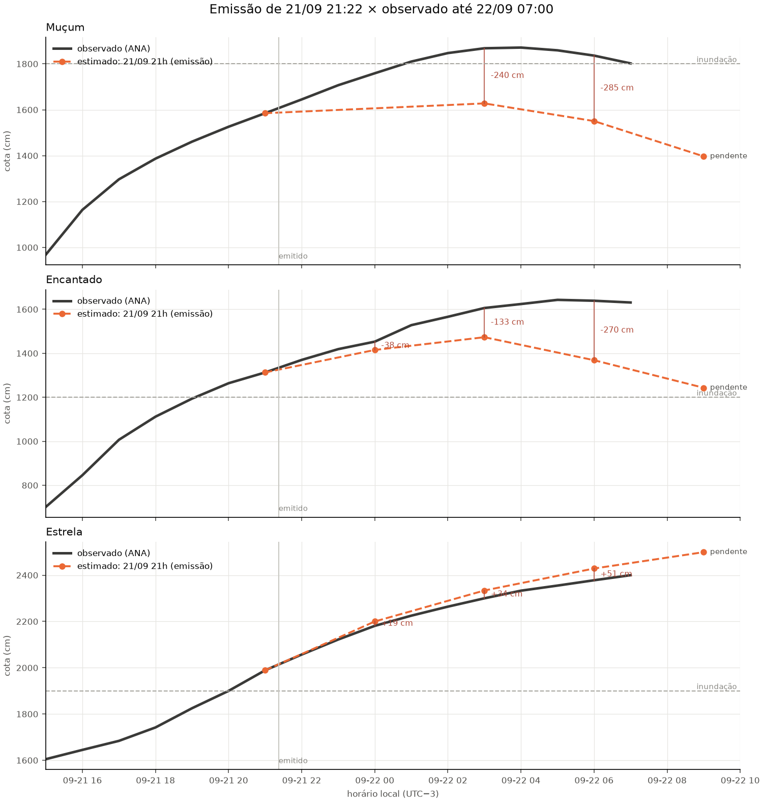
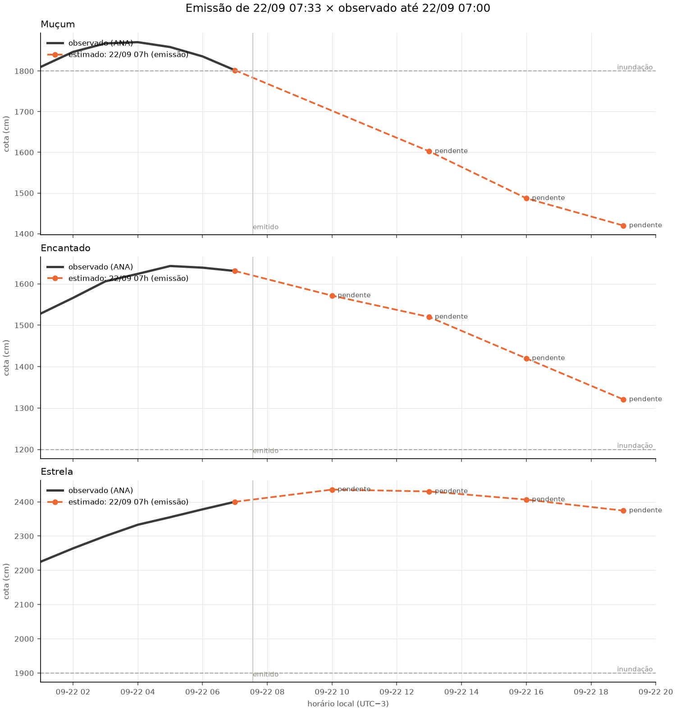

# Cheia de 21–22/09/2026: previsto × observado

Conferência feita em 22/09/2026 07:00 local. Cotas observadas da ANA (grade horária, QC da Fase 2). Cada linha compara um número que estava publicado antes da validade com a cota medida na validade. Erro = previsto − observado: negativo é subestimativa. Nenhuma previsão foi recalculada.

**Não é sistema de alerta.** Para decisão operacional: SACE/SGB e Defesa Civil (199).

## O que aconteceu

| alvo      |   pico_cm | hora_pico_local   |   ultima_cota_cm | ultima_hora_local   |   variacao_3h_cm |   inundacao_cm | cruzou_inundacao_local   |   horas_acima_inundacao |
|:----------|----------:|:------------------|-----------------:|:--------------------|-----------------:|---------------:|:-------------------------|------------------------:|
| Muçum     |      1871 | 22/09 04:00       |             1802 | 22/09 07:00         |              -69 |           1800 | 22/09 01:00              |                       7 |
| Encantado |      1643 | 22/09 05:00       |             1631 | 22/09 07:00         |                7 |           1200 | 21/09 20:00              |                      12 |
| Estrela   |      2400 | 22/09 07:00       |             2400 | 22/09 07:00         |               67 |           1900 | 21/09 20:00              |                      12 |

A variação de 3h é a diferença entre a última cota e a de três horas antes: negativa indica recessão. Um pico igual à última cota significa que o rio ainda não baixou neste cache.

## Emissões reais: erro por horizonte

12 de 17 pares conferidos subestimaram a cota observada.

| emissao             |   h |   MAE_cm |   vies_cm |   n |   subestimou |
|:--------------------|----:|---------:|----------:|----:|-------------:|
| 18h original        |   3 |     12.1 |      -2.5 |   3 |            1 |
| 18h original        |   6 |     21.5 |     -21.5 |   3 |            3 |
| 18h original        |  12 |    127.2 |    -127.2 |   3 |            3 |
| 21/09 21h (emissão) |   3 |     28.3 |      -9.4 |   2 |            1 |
| 21/09 21h (emissão) |   6 |    135.6 |    -113.1 |   3 |            2 |
| 21/09 21h (emissão) |   9 |    202.2 |    -168.3 |   3 |            2 |

## 18h original

Gerada em 21/09 19:07 local. A antecedência real desconta o tempo entre a observação de referência e a gravação do número.

| alvo      | motor   |   h | referencia_local   | validade_local   |   antecedencia_real_h |   previsto_cm | corrigido_cm   | observado_cm   | erro_cm   | erro_corrigido_cm   | status    |
|:----------|:--------|----:|:-------------------|:-----------------|----------------------:|--------------:|:---------------|:---------------|:----------|:--------------------|:----------|
| Encantado | linear  |   3 | 21/09 18:00        | 21/09 21:00      |                   1.9 |        1318.3 | 1415.9         | 1313.0         | 5.3       | 102.9               | conferido |
| Encantado | linear  |   6 | 21/09 18:00        | 22/09 00:00      |                   4.9 |        1438.8 | 1648.7         | 1453.0         | -14.2     | 195.7               | conferido |
| Encantado | gbm     |  12 | 21/09 13:00        | 22/09 01:00      |                   5.9 |        1499.8 | 2121.7         | 1528.0         | -28.2     | 593.7               | conferido |
| Encantado | gbm     |  24 | 21/09 13:00        | 22/09 13:00      |                  17.9 |        1475.5 | —              | —              | —         | —                   | pendente  |
| Estrela   | linear  |   3 | 21/09 18:00        | 21/09 21:00      |                   1.9 |        1967.1 | 1991.5         | 1989.0         | -21.9     | 2.5                 | conferido |
| Estrela   | linear  |   6 | 21/09 18:00        | 22/09 00:00      |                   4.9 |        2162.5 | 2259.6         | 2181.0         | -18.5     | 78.6                | conferido |
| Estrela   | gbm     |  12 | 21/09 13:00        | 22/09 01:00      |                   5.9 |        2132   | 2413.5         | 2225.0         | -93.0     | 188.5               | conferido |
| Estrela   | gbm     |  24 | 21/09 13:00        | 22/09 13:00      |                  17.9 |        2225   | —              | —              | —         | —                   | pendente  |
| Muçum     | linear  |   3 | 21/09 18:00        | 21/09 21:00      |                   1.9 |        1594.1 | 1728.2         | 1585.0         | 9.1       | 143.2               | conferido |
| Muçum     | linear  |   6 | 21/09 18:00        | 22/09 00:00      |                   4.9 |        1727.3 | 2094.7         | 1759.0         | -31.7     | 335.7               | conferido |
| Muçum     | gbm     |  12 | 21/09 13:00        | 22/09 01:00      |                   5.9 |        1549.6 | 2288.1         | 1810.0         | -260.4    | 478.1               | conferido |
| Muçum     | gbm     |  24 | 21/09 13:00        | 22/09 13:00      |                  17.9 |        1421   | —              | —              | —         | —                   | pendente  |

## 18h revisada (replay 19:27)

Gerada em 21/09 19:27 local. Este bloco é um replay gerado com cache depois da referência; não conta como emissão, está aqui porque foi publicado. A antecedência real desconta o tempo entre a observação de referência e a gravação do número.

| alvo      | motor     |   h | referencia_local   | validade_local   |   antecedencia_real_h |   previsto_cm |   observado_cm |   erro_cm | status    |
|:----------|:----------|----:|:-------------------|:-----------------|----------------------:|--------------:|---------------:|----------:|:----------|
| Encantado | linear    |   3 | 21/09 18:00        | 21/09 21:00      |                   1.6 |        1318.3 |           1313 |       5.3 | conferido |
| Encantado | linear    |   6 | 21/09 18:00        | 22/09 00:00      |                   4.6 |        1438.9 |           1453 |     -14.1 | conferido |
| Encantado | gbm_delta |   9 | 21/09 18:00        | 22/09 03:00      |                   7.6 |        1484.4 |           1606 |    -121.6 | conferido |
| Encantado | gbm_delta |  12 | 21/09 18:00        | 22/09 06:00      |                  10.6 |        1541.4 |           1639 |     -97.6 | conferido |
| Estrela   | linear    |   3 | 21/09 18:00        | 21/09 21:00      |                   1.6 |        1967.1 |           1989 |     -21.9 | conferido |
| Estrela   | linear    |   6 | 21/09 18:00        | 22/09 00:00      |                   4.6 |        2162.5 |           2181 |     -18.5 | conferido |
| Estrela   | linear    |   9 | 21/09 18:00        | 22/09 03:00      |                   7.6 |        2283.8 |           2300 |     -16.2 | conferido |
| Estrela   | linear    |  12 | 21/09 18:00        | 22/09 06:00      |                  10.6 |        2366.3 |           2378 |     -11.7 | conferido |
| Muçum     | linear    |   3 | 21/09 18:00        | 21/09 21:00      |                   1.6 |        1594.1 |           1585 |       9.1 | conferido |
| Muçum     | gbm_delta |   6 | 21/09 18:00        | 22/09 00:00      |                   4.6 |        1737.6 |           1759 |     -21.4 | conferido |
| Muçum     | gbm_delta |   9 | 21/09 18:00        | 22/09 03:00      |                   7.6 |        1788.5 |           1868 |     -79.5 | conferido |
| Muçum     | gbm_delta |  12 | 21/09 18:00        | 22/09 06:00      |                  10.6 |        1810.5 |           1836 |     -25.5 | conferido |

## 21/09 21h (emissão)

Gerada em 21/09 21:22 local. A antecedência real desconta o tempo entre a observação de referência e a gravação do número.

| alvo      | motor          |   h | referencia_local   | validade_local   |   antecedencia_real_h | previsto_cm   | observado_cm   | erro_cm   | status      |
|:----------|:---------------|----:|:-------------------|:-----------------|----------------------:|:--------------|:---------------|:----------|:------------|
| Encantado | linear         |   3 | 21/09 21:00        | 22/09 00:00      |                   2.6 | 1415.2        | 1453.0         | -37.8     | conferido   |
| Encantado | ridge_montante |   6 | 21/09 21:00        | 22/09 03:00      |                   5.6 | 1473.3        | 1606.0         | -132.7    | conferido   |
| Encantado | gbm_delta      |   9 | 21/09 21:00        | 22/09 06:00      |                   8.6 | 1368.6        | 1639.0         | -270.4    | conferido   |
| Encantado | gbm_delta      |  12 | 21/09 21:00        | 22/09 09:00      |                  11.6 | 1243.4        | —              | —         | pendente    |
| Estrela   | linear         |   3 | 21/09 21:00        | 22/09 00:00      |                   2.6 | 2199.9        | 2181.0         | 18.9      | conferido   |
| Estrela   | linear         |   6 | 21/09 21:00        | 22/09 03:00      |                   5.6 | 2333.9        | 2300.0         | 33.9      | conferido   |
| Estrela   | linear         |   9 | 21/09 21:00        | 22/09 06:00      |                   8.6 | 2428.8        | 2378.0         | 50.8      | conferido   |
| Estrela   | linear         |  12 | 21/09 21:00        | 22/09 09:00      |                  11.6 | 2499.5        | —              | —         | pendente    |
| Muçum     | linear         |   3 | 21/09 21:00        | 22/09 00:00      |                   2.6 | —             | 1759.0         | —         | não emitida |
| Muçum     | gbm_delta      |   6 | 21/09 21:00        | 22/09 03:00      |                   5.6 | 1627.7        | 1868.0         | -240.3    | conferido   |
| Muçum     | gbm_delta      |   9 | 21/09 21:00        | 22/09 06:00      |                   8.6 | 1550.7        | 1836.0         | -285.3    | conferido   |
| Muçum     | gbm_delta      |  12 | 21/09 21:00        | 22/09 09:00      |                  11.6 | 1397.0        | —              | —         | pendente    |

## 22/09 07h (emissão)

Gerada em 22/09 07:33 local. A antecedência real desconta o tempo entre a observação de referência e a gravação do número.

| alvo      | motor          |   h | referencia_local   | validade_local   |   antecedencia_real_h | previsto_cm   | observado_cm   | erro_cm   | status      |
|:----------|:---------------|----:|:-------------------|:-----------------|----------------------:|:--------------|:---------------|:----------|:------------|
| Encantado | linear         |   3 | 22/09 07:00        | 22/09 10:00      |                   2.4 | 1571.4        | —              | —         | pendente    |
| Encantado | ridge_montante |   6 | 22/09 07:00        | 22/09 13:00      |                   5.4 | 1519.9        | —              | —         | pendente    |
| Encantado | gbm_delta      |   9 | 22/09 07:00        | 22/09 16:00      |                   8.4 | 1419.9        | —              | —         | pendente    |
| Encantado | gbm_delta      |  12 | 22/09 07:00        | 22/09 19:00      |                  11.4 | 1320.7        | —              | —         | pendente    |
| Estrela   | linear         |   3 | 22/09 07:00        | 22/09 10:00      |                   2.4 | 2435.7        | —              | —         | pendente    |
| Estrela   | linear         |   6 | 22/09 07:00        | 22/09 13:00      |                   5.4 | 2430.2        | —              | —         | pendente    |
| Estrela   | linear         |   9 | 22/09 07:00        | 22/09 16:00      |                   8.4 | 2406.3        | —              | —         | pendente    |
| Estrela   | linear         |  12 | 22/09 07:00        | 22/09 19:00      |                  11.4 | 2374.2        | —              | —         | pendente    |
| Muçum     | linear         |   3 | 22/09 07:00        | 22/09 10:00      |                   2.4 | —             | —              | —         | não emitida |
| Muçum     | gbm_delta      |   6 | 22/09 07:00        | 22/09 13:00      |                   5.4 | 1602.5        | —              | —         | pendente    |
| Muçum     | gbm_delta      |   9 | 22/09 07:00        | 22/09 16:00      |                   8.4 | 1487.0        | —              | —         | pendente    |
| Muçum     | gbm_delta      |  12 | 22/09 07:00        | 22/09 19:00      |                  11.4 | 1419.8        | —              | —         | pendente    |

## Leitura

Os números acima são o registro. A interpretação, escrita depois de ver os resultados, está no README e em `10_setembro2026.md`. O CSV com todos os pares está em `13_verificacao_pares.csv`. Para refazer com cache mais novo: `uv run python -m src.live.evento`.
