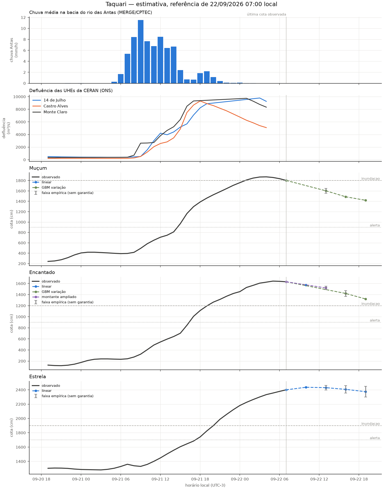

# Revisão da rodada de 22/09/2026 07:00

Modo: **emissao**. Referência observada: 22/09 07:00 (UTC−3). Emissão registrada em 22/09/2026 07:33:12 local. A antecedência real desconta o tempo desde a observação.

Horizontes contados desde a referência da própria estação; chuva e ONS mantêm seus atrasos no treino e na inferência. Alterações de modelo passam por comparação por fase da cheia. A coluna de cota é uma estimativa pontual, não uma cota de pico. Não é sistema de alerta.

| alvo      | motor          |   h | referencia_local   |   observado_cm | previsto_cm   | validade_local   |   antecedencia_real_h | status              |
|:----------|:---------------|----:|:-------------------|---------------:|:--------------|:-----------------|----------------------:|:--------------------|
| Muçum     | linear         |   3 | 22/09 07:00        |           1802 | —             | 22/09 10:00      |                   2.4 | dados_insuficientes |
| Muçum     | gbm_delta      |   6 | 22/09 07:00        |           1802 | 1602.5        | 22/09 13:00      |                   5.4 | estimativa          |
| Muçum     | gbm_delta      |   9 | 22/09 07:00        |           1802 | 1487.0        | 22/09 16:00      |                   8.4 | estimativa          |
| Muçum     | gbm_delta      |  12 | 22/09 07:00        |           1802 | 1419.8        | 22/09 19:00      |                  11.4 | estimativa          |
| Encantado | linear         |   3 | 22/09 07:00        |           1631 | 1571.4        | 22/09 10:00      |                   2.4 | estimativa          |
| Encantado | ridge_montante |   6 | 22/09 07:00        |           1631 | 1519.9        | 22/09 13:00      |                   5.4 | estimativa          |
| Encantado | gbm_delta      |   9 | 22/09 07:00        |           1631 | 1419.9        | 22/09 16:00      |                   8.4 | estimativa          |
| Encantado | gbm_delta      |  12 | 22/09 07:00        |           1631 | 1320.7        | 22/09 19:00      |                  11.4 | estimativa          |
| Estrela   | linear         |   3 | 22/09 07:00        |           2400 | 2435.7        | 22/09 10:00      |                   2.4 | estimativa          |
| Estrela   | linear         |   6 | 22/09 07:00        |           2400 | 2430.2        | 22/09 13:00      |                   5.4 | estimativa          |
| Estrela   | linear         |   9 | 22/09 07:00        |           2400 | 2406.3        | 22/09 16:00      |                   8.4 | estimativa          |
| Estrela   | linear         |  12 | 22/09 07:00        |           2400 | 2374.2        | 22/09 19:00      |                  11.4 | estimativa          |

## Faixas e diagnóstico

As faixas usam o quantil 90% dos erros de 2025, separado por regime, sem garantia de cobertura. Não são publicadas quando há menos de 30 pares, a velocidade está fora da calibração ou a cobertura dos últimos erros conhecidos cai abaixo de 80% (mínimo três pares nas últimas seis horas). Uma faixa ausente não significa erro zero.

| alvo      |   h | inferior_cm   | superior_cm   | faixa_status                   | cobertura_recente_pct   |   n_faixa_recente |
|:----------|----:|:--------------|:--------------|:-------------------------------|:------------------------|------------------:|
| Muçum     |   3 | —             | —             | faltam dados                   | —                       |                 0 |
| Muçum     |   6 | 1555.9        | 1649.1        | empírica, sem garantia         | 83.3                    |                 6 |
| Muçum     |   9 | —             | —             | erros recentes excedem a faixa | 60.0                    |                 5 |
| Muçum     |  12 | —             | —             | erros recentes excedem a faixa | 33.3                    |                 3 |
| Encantado |   3 | —             | —             | sem calibração                 | —                       |                 0 |
| Encantado |   6 | 1488.3        | 1551.5        | empírica, sem garantia         | 83.3                    |                 6 |
| Encantado |   9 | 1367.0        | 1472.8        | empírica, sem garantia         | 100.0                   |                 4 |
| Encantado |  12 | —             | —             | erros recentes excedem a faixa | 33.3                    |                 3 |
| Estrela   |   3 | —             | —             | sem calibração                 | —                       |                 0 |
| Estrela   |   6 | 2398.1        | 2462.4        | empírica, sem garantia         | —                       |                 0 |
| Estrela   |   9 | 2354.7        | 2457.9        | empírica, sem garantia         | —                       |                 0 |
| Estrela   |  12 | 2300.5        | 2447.8        | empírica, sem garantia         | —                       |                 0 |

## Replay da subida

Referências a partir de 21/09 07:00; somente alvos já observados. Horizontes maiores têm menos pares. Ausência de linha significa ausência de pares, não erro zero.

| alvo      |   h |   MAE_cm |   vies_cm |   n |
|:----------|----:|---------:|----------:|----:|
| Encantado |   3 |     71.3 |     -34.7 |  22 |
| Encantado |   6 |    122.2 |     -28.8 |  19 |
| Encantado |   9 |    257.2 |    -237.6 |  16 |
| Encantado |  12 |    443   |    -429.1 |  13 |
| Estrela   |   3 |     28.5 |     -10.4 |  22 |
| Estrela   |   6 |     63.3 |     -40.8 |  19 |
| Estrela   |   9 |    130.1 |    -104.5 |  16 |
| Estrela   |  12 |    248.5 |    -218.7 |  13 |
| Muçum     |   3 |     79.3 |     -30.8 |  22 |
| Muçum     |   6 |    177   |     -41   |  19 |
| Muçum     |   9 |    331.2 |    -236.4 |  16 |
| Muçum     |  12 |    526.9 |    -469.9 |  13 |

Os candidatos são escolhidos em 2023–2024, confirmados em 2025 e podem ser vetados por regressão em 2026. A comparação completa está em [melhoria e aceitação](12_melhoria_live.md). O replay assume atrasos fixos e não recompõe a publicação real de cada fonte.

Arquivo local da execução: `data/processed/live_runs/emissao_20260922T103312157703Z`. Contém previsões, replay, features, datasets de treino, código e configuração.

## Emissões reais conferidas

| alvo      |   h |   MAE_cm |   n |
|:----------|----:|---------:|----:|
| Encantado |   3 |     37.8 |   1 |
| Encantado |   6 |    132.7 |   1 |
| Encantado |   9 |    270.4 |   1 |
| Estrela   |   3 |     18.9 |   1 |
| Estrela   |   6 |     33.9 |   1 |
| Estrela   |   9 |     50.8 |   1 |
| Muçum     |   6 |    240.3 |   1 |
| Muçum     |   9 |    285.3 |   1 |
