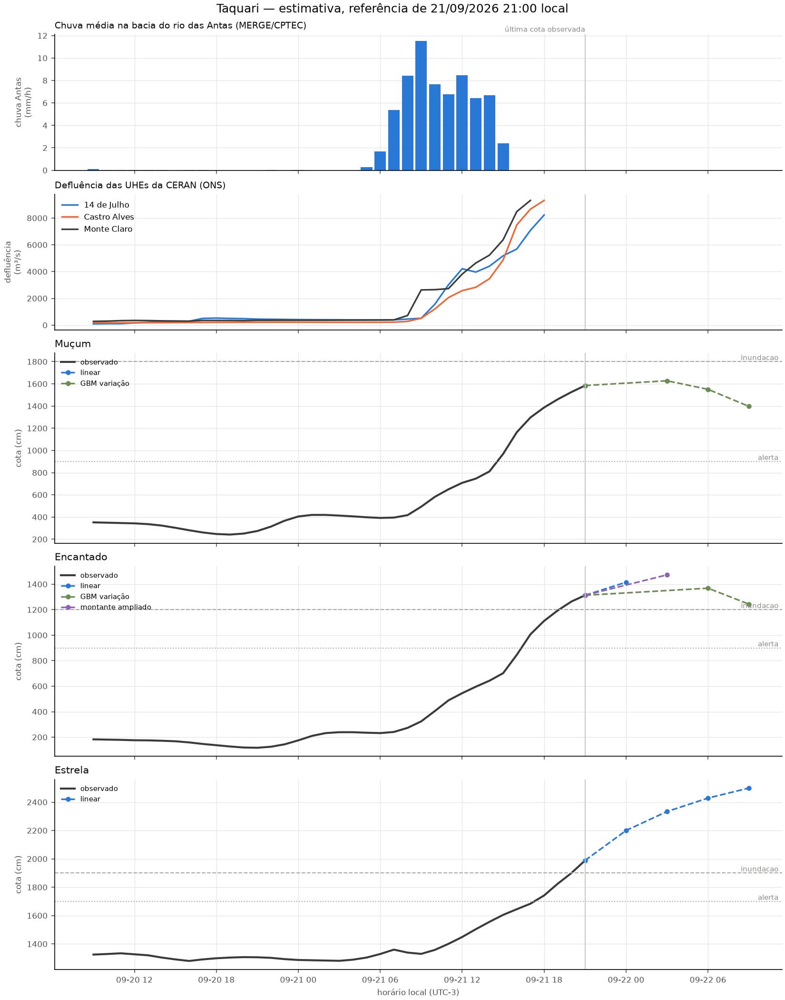

# Revisão da rodada de 21/09/2026 21:00

Modo: **emissao**. Referência observada: 21/09 21:00 (UTC−3). Emissão registrada em 21/09/2026 21:22:09 local. A antecedência real desconta o tempo desde a observação.

Horizontes contados desde a referência da própria estação; chuva e ONS mantêm seus atrasos no treino e na inferência. Alterações de modelo passam por comparação por fase da cheia. A coluna de cota é uma estimativa pontual, não uma cota de pico. Não é sistema de alerta.

**O fundamento histórico não comprova qualidade nesta subida.** Replay de 9h: Encantado: MAE 484 cm, n=7; Estrela: MAE 199 cm, n=7; Muçum: MAE 602 cm, n=7. Consulte também n em 12h: poucos pares não bastam para estimar qualidade neste evento. O desempenho histórico não é uma margem de erro válida para setembro. As previsões da referência das 21:00 ainda não têm observação futura neste cache.

| alvo      | motor          |   h | referencia_local   |   observado_cm | previsto_cm   | validade_local   |   antecedencia_real_h | status              |
|:----------|:---------------|----:|:-------------------|---------------:|:--------------|:-----------------|----------------------:|:--------------------|
| Muçum     | linear         |   3 | 21/09 21:00        |           1585 | —             | 22/09 00:00      |                   2.6 | dados_insuficientes |
| Muçum     | gbm_delta      |   6 | 21/09 21:00        |           1585 | 1627.7        | 22/09 03:00      |                   5.6 | estimativa          |
| Muçum     | gbm_delta      |   9 | 21/09 21:00        |           1585 | 1550.7        | 22/09 06:00      |                   8.6 | estimativa          |
| Muçum     | gbm_delta      |  12 | 21/09 21:00        |           1585 | 1397.0        | 22/09 09:00      |                  11.6 | estimativa          |
| Encantado | linear         |   3 | 21/09 21:00        |           1313 | 1415.2        | 22/09 00:00      |                   2.6 | estimativa          |
| Encantado | ridge_montante |   6 | 21/09 21:00        |           1313 | 1473.3        | 22/09 03:00      |                   5.6 | estimativa          |
| Encantado | gbm_delta      |   9 | 21/09 21:00        |           1313 | 1368.6        | 22/09 06:00      |                   8.6 | estimativa          |
| Encantado | gbm_delta      |  12 | 21/09 21:00        |           1313 | 1243.4        | 22/09 09:00      |                  11.6 | estimativa          |
| Estrela   | linear         |   3 | 21/09 21:00        |           1989 | 2199.9        | 22/09 00:00      |                   2.6 | estimativa          |
| Estrela   | linear         |   6 | 21/09 21:00        |           1989 | 2333.9        | 22/09 03:00      |                   5.6 | estimativa          |
| Estrela   | linear         |   9 | 21/09 21:00        |           1989 | 2428.8        | 22/09 06:00      |                   8.6 | estimativa          |
| Estrela   | linear         |  12 | 21/09 21:00        |           1989 | 2499.5        | 22/09 09:00      |                  11.6 | estimativa          |

## Faixas e diagnóstico

As faixas usam o quantil 90% dos erros de 2025, separado por regime, sem garantia de cobertura. Não são publicadas quando há menos de 30 pares, a velocidade está fora da calibração ou a cobertura dos últimos erros conhecidos cai abaixo de 80% (mínimo três pares nas últimas seis horas). Uma faixa ausente não significa erro zero.

| alvo      |   h | inferior_cm   | superior_cm   | faixa_status                   | cobertura_recente_pct   |   n_faixa_recente |
|:----------|----:|:--------------|:--------------|:-------------------------------|:------------------------|------------------:|
| Muçum     |   3 | —             | —             | faltam dados                   | —                       |                 0 |
| Muçum     |   6 | —             | —             | erros recentes excedem a faixa | 20.0                    |                 5 |
| Muçum     |   9 | —             | —             | erros recentes excedem a faixa | 0.0                     |                 6 |
| Muçum     |  12 | —             | —             | erros recentes excedem a faixa | 0.0                     |                 6 |
| Encantado |   3 | —             | —             | sem calibração                 | —                       |                 0 |
| Encantado |   6 | —             | —             | erros recentes excedem a faixa | 50.0                    |                 6 |
| Encantado |   9 | —             | —             | erros recentes excedem a faixa | 0.0                     |                 6 |
| Encantado |  12 | —             | —             | erros recentes excedem a faixa | 0.0                     |                 6 |
| Estrela   |   3 | —             | —             | sem calibração                 | —                       |                 0 |
| Estrela   |   6 | —             | —             | poucos exemplos neste regime   | 0.0                     |                 1 |
| Estrela   |   9 | —             | —             | poucos exemplos neste regime   | 0.0                     |                 3 |
| Estrela   |  12 | —             | —             | poucos exemplos neste regime   | 0.0                     |                 5 |

## Replay da subida

Referências a partir de 21/09 06:00; somente alvos já observados. Horizontes maiores têm menos pares. Ausência de linha significa ausência de pares, não erro zero.

| alvo      |   h |   MAE_cm |   vies_cm |   n |
|:----------|----:|---------:|----------:|----:|
| Encantado |   3 |    104.2 |     -58.1 |  13 |
| Encantado |   6 |    193.1 |    -160   |  10 |
| Encantado |   9 |    483.6 |    -483.6 |   7 |
| Encantado |  12 |    846   |    -846   |   4 |
| Estrela   |   3 |     39.7 |     -23   |  13 |
| Estrela   |   6 |     94.8 |     -94.8 |  10 |
| Estrela   |   9 |    198.7 |    -198.7 |   7 |
| Estrela   |  12 |    399   |    -399   |   4 |
| Muçum     |   3 |    117.1 |     -86.1 |  13 |
| Muçum     |   6 |    240.7 |    -240.7 |  10 |
| Muçum     |   9 |    602.3 |    -602.3 |   7 |
| Muçum     |  12 |    987   |    -987   |   4 |

Os candidatos são escolhidos em 2023–2024, confirmados em 2025 e podem ser vetados por regressão em 2026. A comparação completa está em [melhoria e aceitação](12_melhoria_live.md). O replay assume atrasos fixos e não recompõe a publicação real de cada fonte.

Arquivo local da execução: `data/processed/live_runs/emissao_20260922T002209578274Z`. Contém previsões, replay, features, datasets de treino, código e configuração.

## Emissões reais conferidas

Nenhuma emissão real arquivada com alvo já observável. Replays não contam como emissões.
