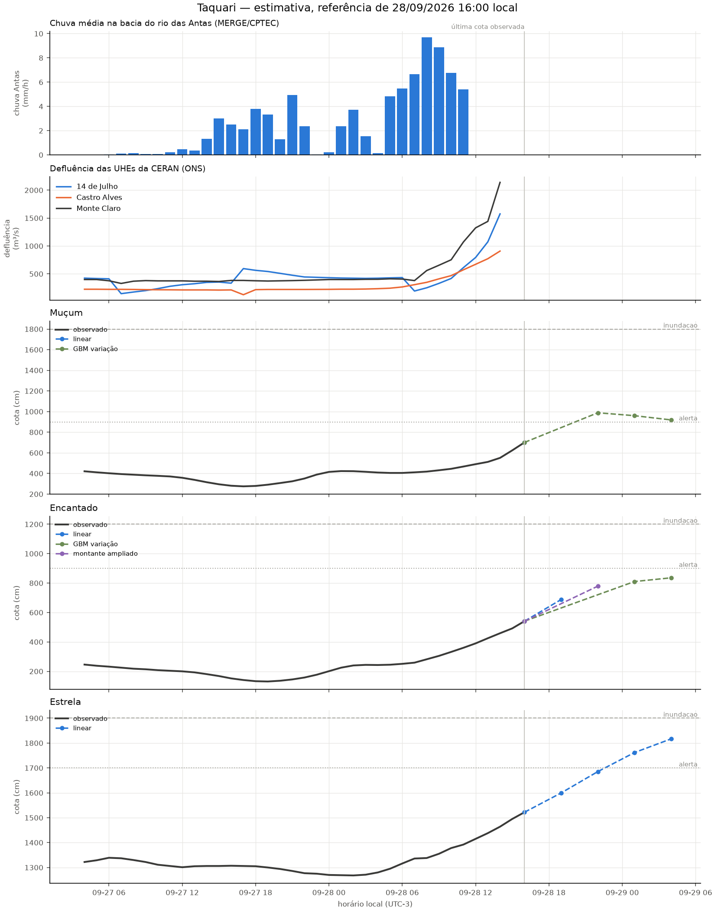

# Revisão da rodada de 28/09/2026 16:00

Modo: **emissao**. Referência observada: 28/09 16:00 (UTC−3). Emissão registrada em 28/09/2026 16:38:51 local. A antecedência real desconta o tempo desde a observação.

Horizontes contados desde a referência da própria estação; chuva e ONS mantêm seus atrasos no treino e na inferência. Alterações de modelo passam por comparação por fase da cheia. A coluna de cota é uma estimativa pontual, não uma cota de pico. Não é sistema de alerta.

| alvo      | motor          |   h | referencia_local   |   observado_cm | previsto_cm   | validade_local   |   antecedencia_real_h | status              |
|:----------|:---------------|----:|:-------------------|---------------:|:--------------|:-----------------|----------------------:|:--------------------|
| Muçum     | linear         |   3 | 28/09 16:00        |            701 | —             | 28/09 19:00      |                   2.4 | dados_insuficientes |
| Muçum     | gbm_delta      |   6 | 28/09 16:00        |            701 | 988.3         | 28/09 22:00      |                   5.4 | estimativa          |
| Muçum     | gbm_delta      |   9 | 28/09 16:00        |            701 | 960.2         | 29/09 01:00      |                   8.4 | estimativa          |
| Muçum     | gbm_delta      |  12 | 28/09 16:00        |            701 | 919.0         | 29/09 04:00      |                  11.4 | estimativa          |
| Encantado | linear         |   3 | 28/09 16:00        |            541 | 688.1         | 28/09 19:00      |                   2.4 | estimativa          |
| Encantado | ridge_montante |   6 | 28/09 16:00        |            541 | 779.1         | 28/09 22:00      |                   5.4 | estimativa          |
| Encantado | gbm_delta      |   9 | 28/09 16:00        |            541 | 810.4         | 29/09 01:00      |                   8.4 | estimativa          |
| Encantado | gbm_delta      |  12 | 28/09 16:00        |            541 | 835.8         | 29/09 04:00      |                  11.4 | estimativa          |
| Estrela   | linear         |   3 | 28/09 16:00        |           1522 | 1599.6        | 28/09 19:00      |                   2.4 | estimativa          |
| Estrela   | linear         |   6 | 28/09 16:00        |           1522 | 1685.3        | 28/09 22:00      |                   5.4 | estimativa          |
| Estrela   | linear         |   9 | 28/09 16:00        |           1522 | 1761.8        | 29/09 01:00      |                   8.4 | estimativa          |
| Estrela   | linear         |  12 | 28/09 16:00        |           1522 | 1816.9        | 29/09 04:00      |                  11.4 | estimativa          |

## Faixas e diagnóstico

As faixas usam o quantil 90% dos erros de 2025, separado por regime, sem garantia de cobertura. Não são publicadas quando há menos de 30 pares, a velocidade está fora da calibração ou a cobertura dos últimos erros conhecidos cai abaixo de 80% (mínimo três pares nas últimas seis horas). Uma faixa ausente não significa erro zero.

| alvo      |   h | inferior_cm   | superior_cm   | faixa_status                   | cobertura_recente_pct   |   n_faixa_recente |
|:----------|----:|:--------------|:--------------|:-------------------------------|:------------------------|------------------:|
| Muçum     |   3 | —             | —             | faltam dados                   | —                       |                 0 |
| Muçum     |   6 | —             | —             | erros recentes excedem a faixa | 16.7                    |                 6 |
| Muçum     |   9 | —             | —             | erros recentes excedem a faixa | 33.3                    |                 6 |
| Muçum     |  12 | —             | —             | erros recentes excedem a faixa | 66.7                    |                 6 |
| Encantado |   3 | —             | —             | sem calibração                 | —                       |                 0 |
| Encantado |   6 | —             | —             | erros recentes excedem a faixa | 0.0                     |                 6 |
| Encantado |   9 | —             | —             | erros recentes excedem a faixa | 0.0                     |                 6 |
| Encantado |  12 | —             | —             | erros recentes excedem a faixa | 16.7                    |                 6 |
| Estrela   |   3 | —             | —             | sem calibração                 | —                       |                 0 |
| Estrela   |   6 | —             | —             | erros recentes excedem a faixa | 0.0                     |                 6 |
| Estrela   |   9 | —             | —             | erros recentes excedem a faixa | 0.0                     |                 6 |
| Estrela   |  12 | —             | —             | erros recentes excedem a faixa | 50.0                    |                 6 |

## Replay da subida

Referências a partir de 27/09 16:00; somente alvos já observados. Horizontes maiores têm menos pares. Ausência de linha significa ausência de pares, não erro zero.

| alvo      |   h |   MAE_cm |   vies_cm |   n |
|:----------|----:|---------:|----------:|----:|
| Encantado |   3 |     26.1 |     -20.4 |  22 |
| Encantado |   6 |     61.2 |     -61.2 |  19 |
| Encantado |   9 |     87.2 |     -72.3 |  16 |
| Encantado |  12 |     93.8 |     -79.9 |  13 |
| Estrela   |   3 |     12.1 |      -7.1 |  22 |
| Estrela   |   6 |     27.6 |     -21.9 |  19 |
| Estrela   |   9 |     48.2 |     -48   |  16 |
| Estrela   |  12 |     81.9 |     -81.9 |  13 |
| Muçum     |   3 |     32.9 |     -25.9 |  22 |
| Muçum     |   6 |     53.7 |     -31.6 |  19 |
| Muçum     |   9 |     77.1 |     -19.2 |  16 |
| Muçum     |  12 |     74.9 |     -17.2 |  13 |

Os candidatos são escolhidos em 2023–2024, confirmados em 2025 e podem ser vetados por regressão em 2026. A comparação completa está em [melhoria e aceitação](12_melhoria_live.md). O replay assume atrasos fixos e não recompõe a publicação real de cada fonte.

Arquivo local da execução: `data/processed/live_runs/emissao_20260928T193851488033Z`. Contém previsões, replay, features, datasets de treino, código e configuração.

## Emissões reais conferidas

| alvo      |   h |   MAE_cm |   n |
|:----------|----:|---------:|----:|
| Encantado |   3 |     35.6 |   6 |
| Encantado |   6 |    117   |   4 |
| Encantado |   9 |    258.6 |   2 |
| Encantado |  12 |    313.7 |   2 |
| Estrela   |   3 |     14.9 |   6 |
| Estrela   |   6 |     39.2 |   4 |
| Estrela   |   9 |     28.2 |   2 |
| Estrela   |  12 |     54.8 |   2 |
| Muçum     |   3 |    109.2 |   1 |
| Muçum     |   6 |    155.2 |   4 |
| Muçum     |   9 |    250.1 |   2 |
| Muçum     |  12 |    284.4 |   2 |
