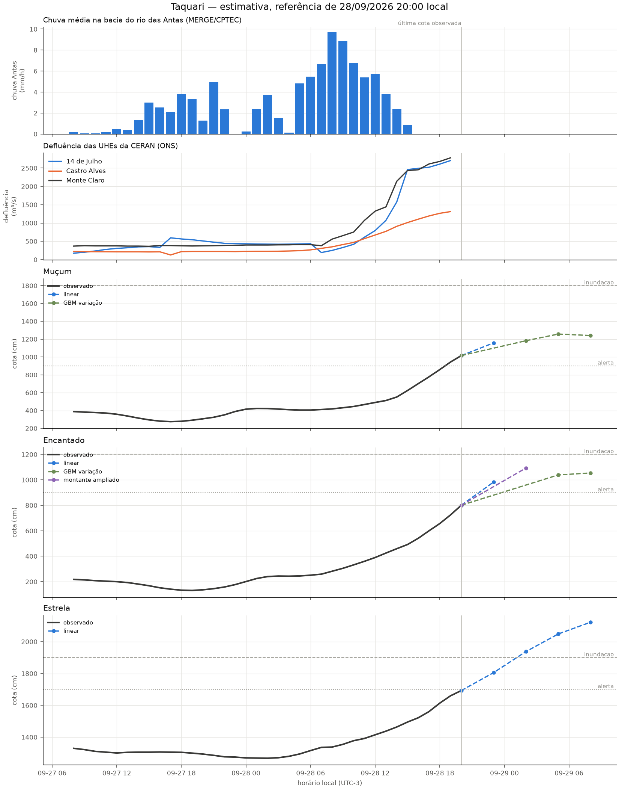

# Revisão da rodada de 28/09/2026 20:00

Modo: **emissao**. Referência observada: 28/09 20:00 (UTC−3). Emissão registrada em 28/09/2026 21:24:30 local. A antecedência real desconta o tempo desde a observação.

Horizontes contados desde a referência da própria estação; chuva e ONS mantêm seus atrasos no treino e na inferência. Alterações de modelo passam por comparação por fase da cheia. A coluna de cota é uma estimativa pontual, não uma cota de pico. Não é sistema de alerta.

| alvo      | motor          |   h | referencia_local   |   observado_cm |   previsto_cm | validade_local   |   antecedencia_real_h | status     |
|:----------|:---------------|----:|:-------------------|---------------:|--------------:|:-----------------|----------------------:|:-----------|
| Muçum     | linear         |   3 | 28/09 20:00        |           1016 |        1157.9 | 28/09 23:00      |                   1.6 | estimativa |
| Muçum     | gbm_delta      |   6 | 28/09 20:00        |           1016 |        1182.3 | 29/09 02:00      |                   4.6 | estimativa |
| Muçum     | gbm_delta      |   9 | 28/09 20:00        |           1016 |        1256.9 | 29/09 05:00      |                   7.6 | estimativa |
| Muçum     | gbm_delta      |  12 | 28/09 20:00        |           1016 |        1240.8 | 29/09 08:00      |                  10.6 | estimativa |
| Encantado | linear         |   3 | 28/09 20:00        |            801 |         983.3 | 28/09 23:00      |                   1.6 | estimativa |
| Encantado | ridge_montante |   6 | 28/09 20:00        |            801 |        1093   | 29/09 02:00      |                   4.6 | estimativa |
| Encantado | gbm_delta      |   9 | 28/09 20:00        |            801 |        1038.8 | 29/09 05:00      |                   7.6 | estimativa |
| Encantado | gbm_delta      |  12 | 28/09 20:00        |            801 |        1054.3 | 29/09 08:00      |                  10.6 | estimativa |
| Estrela   | linear         |   3 | 28/09 20:00        |           1693 |        1805.6 | 28/09 23:00      |                   1.6 | estimativa |
| Estrela   | linear         |   6 | 28/09 20:00        |           1693 |        1937.4 | 29/09 02:00      |                   4.6 | estimativa |
| Estrela   | linear         |   9 | 28/09 20:00        |           1693 |        2048.1 | 29/09 05:00      |                   7.6 | estimativa |
| Estrela   | linear         |  12 | 28/09 20:00        |           1693 |        2121.9 | 29/09 08:00      |                  10.6 | estimativa |

## Faixas e diagnóstico

As faixas usam o quantil 90% dos erros de 2025, separado por regime, sem garantia de cobertura. Não são publicadas quando há menos de 30 pares, a velocidade está fora da calibração ou a cobertura dos últimos erros conhecidos cai abaixo de 80% (mínimo três pares nas últimas seis horas). Uma faixa ausente não significa erro zero.

| alvo      |   h | inferior_cm   | superior_cm   | faixa_status                   | cobertura_recente_pct   |   n_faixa_recente |
|:----------|----:|:--------------|:--------------|:-------------------------------|:------------------------|------------------:|
| Muçum     |   3 | —             | —             | sem calibração                 | —                       |                 0 |
| Muçum     |   6 | —             | —             | erros recentes excedem a faixa | 33.3                    |                 6 |
| Muçum     |   9 | —             | —             | erros recentes excedem a faixa | 0.0                     |                 6 |
| Muçum     |  12 | —             | —             | erros recentes excedem a faixa | 0.0                     |                 6 |
| Encantado |   3 | —             | —             | sem calibração                 | —                       |                 0 |
| Encantado |   6 | —             | —             | erros recentes excedem a faixa | 0.0                     |                 6 |
| Encantado |   9 | —             | —             | erros recentes excedem a faixa | 0.0                     |                 6 |
| Encantado |  12 | —             | —             | erros recentes excedem a faixa | 0.0                     |                 6 |
| Estrela   |   3 | —             | —             | sem calibração                 | —                       |                 0 |
| Estrela   |   6 | —             | —             | poucos exemplos neste regime   | 0.0                     |                 6 |
| Estrela   |   9 | —             | —             | poucos exemplos neste regime   | 0.0                     |                 6 |
| Estrela   |  12 | —             | —             | poucos exemplos neste regime   | 0.0                     |                 6 |

## Replay da subida

Referências a partir de 27/09 20:00; somente alvos já observados. Horizontes maiores têm menos pares. Ausência de linha significa ausência de pares, não erro zero.

| alvo      |   h |   MAE_cm |   vies_cm |   n |
|:----------|----:|---------:|----------:|----:|
| Encantado |   3 |     31.6 |     -25.9 |  22 |
| Encantado |   6 |     83.3 |     -83.3 |  19 |
| Encantado |   9 |    128   |    -117.6 |  16 |
| Encantado |  12 |    173.6 |    -163.4 |  13 |
| Estrela   |   3 |     18   |     -14.2 |  22 |
| Estrela   |   6 |     44.2 |     -40.2 |  19 |
| Estrela   |   9 |     81.7 |     -81.7 |  16 |
| Estrela   |  12 |    133.1 |    -133.1 |  13 |
| Muçum     |   3 |     44   |     -37.1 |  22 |
| Muçum     |   6 |     60.2 |     -35.4 |  19 |
| Muçum     |   9 |    120.4 |     -76.8 |  16 |
| Muçum     |  12 |    176.1 |    -125.7 |  13 |

Os candidatos são escolhidos em 2023–2024, confirmados em 2025 e podem ser vetados por regressão em 2026. A comparação completa está em [melhoria e aceitação](12_melhoria_live.md). O replay assume atrasos fixos e não recompõe a publicação real de cada fonte.

Arquivo local da execução: `data/processed/live_runs/emissao_20260929T002430467959Z`. Contém previsões, replay, features, datasets de treino, código e configuração.

## Emissões reais conferidas

| alvo      |   h |   MAE_cm |   n |
|:----------|----:|---------:|----:|
| Encantado |   3 |     39.9 |  10 |
| Encantado |   6 |    132   |   7 |
| Encantado |   9 |    227.6 |   4 |
| Encantado |  12 |    313.7 |   2 |
| Estrela   |   3 |     23.8 |  10 |
| Estrela   |   6 |     61.8 |   7 |
| Estrela   |   9 |     81   |   4 |
| Estrela   |  12 |     54.8 |   2 |
| Muçum     |   3 |    109.2 |   1 |
| Muçum     |   6 |    172.1 |   7 |
| Muçum     |   9 |    276.7 |   4 |
| Muçum     |  12 |    284.4 |   2 |
