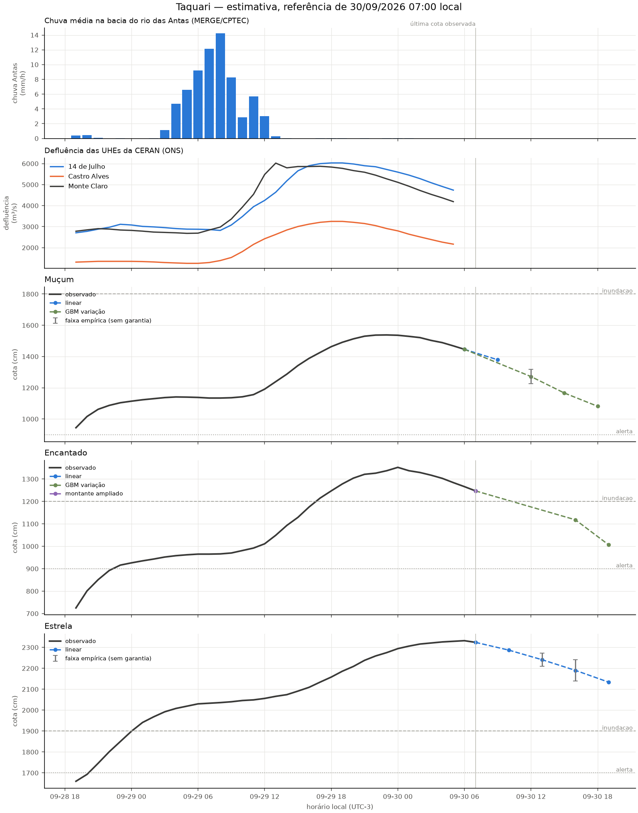

# Revisão da rodada de 30/09/2026 07:00

Modo: **emissao**. Referência observada: 30/09 07:00 (UTC−3). Emissão registrada em 30/09/2026 07:40:32 local. A antecedência real desconta o tempo desde a observação.

Horizontes contados desde a referência da própria estação; chuva e ONS mantêm seus atrasos no treino e na inferência. Alterações de modelo passam por comparação por fase da cheia. A coluna de cota é uma estimativa pontual, não uma cota de pico. Não é sistema de alerta.

| alvo      | motor          |   h | referencia_local   |   observado_cm | previsto_cm   | validade_local   |   antecedencia_real_h | status              |
|:----------|:---------------|----:|:-------------------|---------------:|:--------------|:-----------------|----------------------:|:--------------------|
| Muçum     | linear         |   3 | 30/09 07:00        |           1419 | —             | 30/09 10:00      |                   2.3 | dados_insuficientes |
| Muçum     | gbm_delta      |   6 | 30/09 07:00        |           1419 | 1305.7        | 30/09 13:00      |                   5.3 | estimativa          |
| Muçum     | gbm_delta      |   9 | 30/09 07:00        |           1419 | 1163.1        | 30/09 16:00      |                   8.3 | estimativa          |
| Muçum     | gbm_delta      |  12 | 30/09 07:00        |           1419 | 1087.1        | 30/09 19:00      |                  11.3 | estimativa          |
| Encantado | linear         |   3 | 30/09 07:00        |           1247 | 1186.9        | 30/09 10:00      |                   2.3 | estimativa          |
| Encantado | ridge_montante |   6 | 30/09 07:00        |           1247 | 1130.2        | 30/09 13:00      |                   5.3 | estimativa          |
| Encantado | gbm_delta      |   9 | 30/09 07:00        |           1247 | 1017.7        | 30/09 16:00      |                   8.3 | estimativa          |
| Encantado | gbm_delta      |  12 | 30/09 07:00        |           1247 | 881.7         | 30/09 19:00      |                  11.3 | estimativa          |
| Estrela   | linear         |   3 | 30/09 07:00        |           2324 | 2286.9        | 30/09 10:00      |                   2.3 | estimativa          |
| Estrela   | linear         |   6 | 30/09 07:00        |           2324 | 2240.9        | 30/09 13:00      |                   5.3 | estimativa          |
| Estrela   | linear         |   9 | 30/09 07:00        |           2324 | 2190.1        | 30/09 16:00      |                   8.3 | estimativa          |
| Estrela   | linear         |  12 | 30/09 07:00        |           2324 | 2133.7        | 30/09 19:00      |                  11.3 | estimativa          |

## Faixas e diagnóstico

As faixas usam o quantil 90% dos erros de 2025, separado por regime, sem garantia de cobertura. Não são publicadas quando há menos de 30 pares, a velocidade está fora da calibração ou a cobertura dos últimos erros conhecidos cai abaixo de 80% (mínimo três pares nas últimas seis horas). Uma faixa ausente não significa erro zero.

| alvo      |   h | inferior_cm   | superior_cm   | faixa_status                   | cobertura_recente_pct   |   n_faixa_recente |
|:----------|----:|:--------------|:--------------|:-------------------------------|:------------------------|------------------:|
| Muçum     |   3 | —             | —             | faltam dados                   | —                       |                 0 |
| Muçum     |   6 | 1259.7        | 1351.6        | empírica, sem garantia         | 100.0                   |                 6 |
| Muçum     |   9 | 1086.7        | 1239.5        | empírica, sem garantia         | 83.3                    |                 6 |
| Muçum     |  12 | —             | —             | erros recentes excedem a faixa | 16.7                    |                 6 |
| Encantado |   3 | —             | —             | sem calibração                 | —                       |                 0 |
| Encantado |   6 | —             | —             | erros recentes excedem a faixa | 50.0                    |                 6 |
| Encantado |   9 | —             | —             | erros recentes excedem a faixa | 66.7                    |                 6 |
| Encantado |  12 | —             | —             | erros recentes excedem a faixa | 33.3                    |                 6 |
| Estrela   |   3 | —             | —             | sem calibração                 | —                       |                 0 |
| Estrela   |   6 | 2208.8        | 2273.0        | empírica, sem garantia         | 100.0                   |                 6 |
| Estrela   |   9 | 2138.4        | 2241.7        | empírica, sem garantia         | 100.0                   |                 6 |
| Estrela   |  12 | —             | —             | erros recentes excedem a faixa | 66.7                    |                 6 |

## Replay da subida

Referências a partir de 29/09 07:00; somente alvos já observados. Horizontes maiores têm menos pares. Ausência de linha significa ausência de pares, não erro zero.

| alvo      |   h |   MAE_cm |   vies_cm |   n |
|:----------|----:|---------:|----------:|----:|
| Encantado |   3 |     23.5 |     -11.2 |  22 |
| Encantado |   6 |     62.8 |     -17.7 |  19 |
| Encantado |   9 |    144.4 |      58.8 |  16 |
| Encantado |  12 |    216.6 |      48.1 |  13 |
| Estrela   |   3 |      9.7 |      -7.9 |  22 |
| Estrela   |   6 |     29.3 |     -25   |  19 |
| Estrela   |   9 |     68.1 |     -63.4 |  16 |
| Estrela   |  12 |    130.3 |    -126.5 |  13 |
| Muçum     |   3 |     30.3 |     -13.1 |  22 |
| Muçum     |   6 |    119.9 |      75.3 |  19 |
| Muçum     |   9 |    173.2 |      70.7 |  16 |
| Muçum     |  12 |    274.5 |      85.6 |  13 |

Os candidatos são escolhidos em 2023–2024, confirmados em 2025 e podem ser vetados por regressão em 2026. A comparação completa está em [melhoria e aceitação](12_melhoria_live.md). O replay assume atrasos fixos e não recompõe a publicação real de cada fonte.

Arquivo local da execução: `data/processed/live_runs/emissao_20260930T104032914855Z`. Contém previsões, replay, features, datasets de treino, código e configuração.

## Emissões reais conferidas

| alvo      |   h |   MAE_cm |   n |
|:----------|----:|---------:|----:|
| Encantado |   3 |     34.9 |  24 |
| Encantado |   6 |    109.8 |  24 |
| Encantado |   9 |    131   |  24 |
| Encantado |  12 |    169.4 |  24 |
| Estrela   |   3 |     18.2 |  24 |
| Estrela   |   6 |     52.9 |  24 |
| Estrela   |   9 |     99.6 |  24 |
| Estrela   |  12 |    149   |  24 |
| Muçum     |   3 |     54.7 |   4 |
| Muçum     |   6 |    115.8 |  24 |
| Muçum     |   9 |    187.6 |  24 |
| Muçum     |  12 |    228.8 |  24 |
