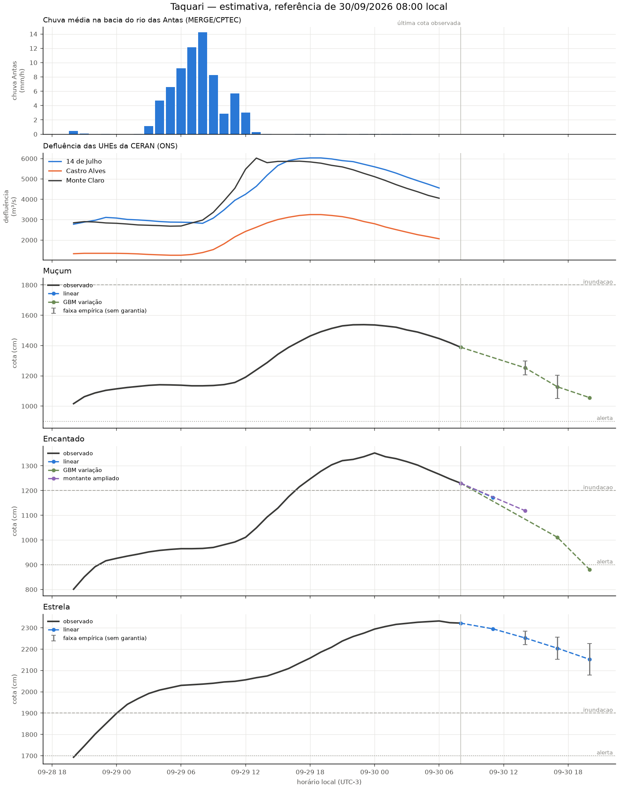

# Revisão da rodada de 30/09/2026 08:00

Modo: **emissao**. Referência observada: 30/09 08:00 (UTC−3). Emissão registrada em 30/09/2026 08:40:34 local. A antecedência real desconta o tempo desde a observação.

Horizontes contados desde a referência da própria estação; chuva e ONS mantêm seus atrasos no treino e na inferência. Alterações de modelo passam por comparação por fase da cheia. A coluna de cota é uma estimativa pontual, não uma cota de pico. Não é sistema de alerta.

| alvo      | motor          |   h | referencia_local   |   observado_cm | previsto_cm   | validade_local   |   antecedencia_real_h | status              |
|:----------|:---------------|----:|:-------------------|---------------:|:--------------|:-----------------|----------------------:|:--------------------|
| Muçum     | linear         |   3 | 30/09 08:00        |           1389 | —             | 30/09 11:00      |                   2.3 | dados_insuficientes |
| Muçum     | gbm_delta      |   6 | 30/09 08:00        |           1389 | 1252.7        | 30/09 14:00      |                   5.3 | estimativa          |
| Muçum     | gbm_delta      |   9 | 30/09 08:00        |           1389 | 1127.7        | 30/09 17:00      |                   8.3 | estimativa          |
| Muçum     | gbm_delta      |  12 | 30/09 08:00        |           1389 | 1055.8        | 30/09 20:00      |                  11.3 | estimativa          |
| Encantado | linear         |   3 | 30/09 08:00        |           1230 | 1171.9        | 30/09 11:00      |                   2.3 | estimativa          |
| Encantado | ridge_montante |   6 | 30/09 08:00        |           1230 | 1118.6        | 30/09 14:00      |                   5.3 | estimativa          |
| Encantado | gbm_delta      |   9 | 30/09 08:00        |           1230 | 1011.1        | 30/09 17:00      |                   8.3 | estimativa          |
| Encantado | gbm_delta      |  12 | 30/09 08:00        |           1230 | 880.7         | 30/09 20:00      |                  11.3 | estimativa          |
| Estrela   | linear         |   3 | 30/09 08:00        |           2322 | 2295.2        | 30/09 11:00      |                   2.3 | estimativa          |
| Estrela   | linear         |   6 | 30/09 08:00        |           2322 | 2252.3        | 30/09 14:00      |                   5.3 | estimativa          |
| Estrela   | linear         |   9 | 30/09 08:00        |           2322 | 2204.2        | 30/09 17:00      |                   8.3 | estimativa          |
| Estrela   | linear         |  12 | 30/09 08:00        |           2322 | 2152.0        | 30/09 20:00      |                  11.3 | estimativa          |

## Faixas e diagnóstico

As faixas usam o quantil 90% dos erros de 2025, separado por regime, sem garantia de cobertura. Não são publicadas quando há menos de 30 pares, a velocidade está fora da calibração ou a cobertura dos últimos erros conhecidos cai abaixo de 80% (mínimo três pares nas últimas seis horas). Uma faixa ausente não significa erro zero.

| alvo      |   h | inferior_cm   | superior_cm   | faixa_status                   | cobertura_recente_pct   |   n_faixa_recente |
|:----------|----:|:--------------|:--------------|:-------------------------------|:------------------------|------------------:|
| Muçum     |   3 | —             | —             | faltam dados                   | —                       |                 0 |
| Muçum     |   6 | 1206.7        | 1298.6        | empírica, sem garantia         | 100.0                   |                 6 |
| Muçum     |   9 | 1051.3        | 1204.0        | empírica, sem garantia         | 100.0                   |                 6 |
| Muçum     |  12 | —             | —             | erros recentes excedem a faixa | 33.3                    |                 6 |
| Encantado |   3 | —             | —             | sem calibração                 | —                       |                 0 |
| Encantado |   6 | —             | —             | erros recentes excedem a faixa | 66.7                    |                 6 |
| Encantado |   9 | —             | —             | erros recentes excedem a faixa | 66.7                    |                 6 |
| Encantado |  12 | —             | —             | erros recentes excedem a faixa | 33.3                    |                 6 |
| Estrela   |   3 | —             | —             | sem calibração                 | —                       |                 0 |
| Estrela   |   6 | 2220.2        | 2284.4        | empírica, sem garantia         | 100.0                   |                 6 |
| Estrela   |   9 | 2152.6        | 2255.8        | empírica, sem garantia         | 100.0                   |                 6 |
| Estrela   |  12 | 2078.3        | 2225.6        | empírica, sem garantia         | 83.3                    |                 6 |

## Replay da subida

Referências a partir de 29/09 08:00; somente alvos já observados. Horizontes maiores têm menos pares. Ausência de linha significa ausência de pares, não erro zero.

| alvo      |   h |   MAE_cm |   vies_cm |   n |
|:----------|----:|---------:|----------:|----:|
| Encantado |   3 |     22.5 |     -10.1 |  22 |
| Encantado |   6 |     58   |     -10.5 |  19 |
| Encantado |   9 |    130.4 |      76.1 |  16 |
| Encantado |  12 |    186.5 |      80.9 |  13 |
| Estrela   |   3 |      9.6 |      -7.8 |  22 |
| Estrela   |   6 |     28   |     -23.8 |  19 |
| Estrela   |   9 |     62.4 |     -57.3 |  16 |
| Estrela   |  12 |    116.2 |    -110.3 |  13 |
| Muçum     |   3 |     29.5 |     -11   |  22 |
| Muçum     |   6 |    113.5 |      82.6 |  19 |
| Muçum     |   9 |    155.9 |      87.9 |  16 |
| Muçum     |  12 |    241.3 |     126.3 |  13 |

Os candidatos são escolhidos em 2023–2024, confirmados em 2025 e podem ser vetados por regressão em 2026. A comparação completa está em [melhoria e aceitação](12_melhoria_live.md). O replay assume atrasos fixos e não recompõe a publicação real de cada fonte.

Arquivo local da execução: `data/processed/live_runs/emissao_20260930T114034264131Z`. Contém previsões, replay, features, datasets de treino, código e configuração.

## Emissões reais conferidas

| alvo      |   h |   MAE_cm |   n |
|:----------|----:|---------:|----:|
| Encantado |   3 |     34.9 |  24 |
| Encantado |   6 |    109.8 |  24 |
| Encantado |   9 |    131   |  24 |
| Encantado |  12 |    169.4 |  24 |
| Estrela   |   3 |     18.2 |  24 |
| Estrela   |   6 |     52.9 |  24 |
| Estrela   |   9 |     99.6 |  24 |
| Estrela   |  12 |    149   |  24 |
| Muçum     |   3 |     54.7 |   4 |
| Muçum     |   6 |    115.8 |  24 |
| Muçum     |   9 |    187.6 |  24 |
| Muçum     |  12 |    228.8 |  24 |
