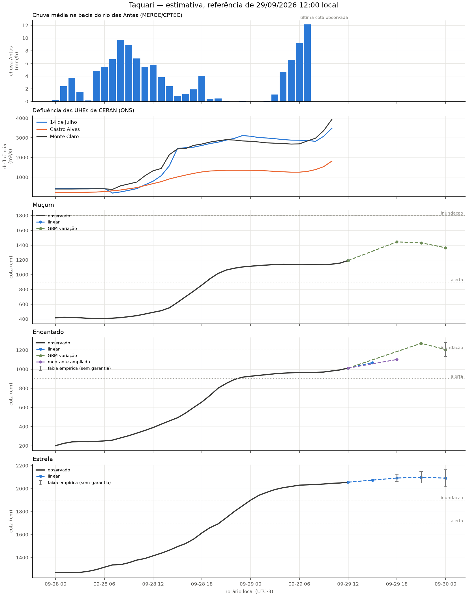

# Revisão da rodada de 29/09/2026 12:00

Modo: **emissao**. Referência observada: 29/09 12:00 (UTC−3). Emissão registrada em 29/09/2026 12:40:33 local. A antecedência real desconta o tempo desde a observação.

Horizontes contados desde a referência da própria estação; chuva e ONS mantêm seus atrasos no treino e na inferência. Alterações de modelo passam por comparação por fase da cheia. A coluna de cota é uma estimativa pontual, não uma cota de pico. Não é sistema de alerta.

| alvo      | motor          |   h | referencia_local   |   observado_cm | previsto_cm   | validade_local   |   antecedencia_real_h | status              |
|:----------|:---------------|----:|:-------------------|---------------:|:--------------|:-----------------|----------------------:|:--------------------|
| Muçum     | linear         |   3 | 29/09 12:00        |           1191 | —             | 29/09 15:00      |                   2.3 | dados_insuficientes |
| Muçum     | gbm_delta      |   6 | 29/09 12:00        |           1191 | 1443.5        | 29/09 18:00      |                   5.3 | estimativa          |
| Muçum     | gbm_delta      |   9 | 29/09 12:00        |           1191 | 1430.4        | 29/09 21:00      |                   8.3 | estimativa          |
| Muçum     | gbm_delta      |  12 | 29/09 12:00        |           1191 | 1364.3        | 30/09 00:00      |                  11.3 | estimativa          |
| Encantado | linear         |   3 | 29/09 12:00        |           1011 | 1068.4        | 29/09 15:00      |                   2.3 | estimativa          |
| Encantado | ridge_montante |   6 | 29/09 12:00        |           1011 | 1100.4        | 29/09 18:00      |                   5.3 | estimativa          |
| Encantado | gbm_delta      |   9 | 29/09 12:00        |           1011 | 1269.8        | 29/09 21:00      |                   8.3 | estimativa          |
| Encantado | gbm_delta      |  12 | 29/09 12:00        |           1011 | 1204.3        | 30/09 00:00      |                  11.3 | estimativa          |
| Estrela   | linear         |   3 | 29/09 12:00        |           2056 | 2074.1        | 29/09 15:00      |                   2.3 | estimativa          |
| Estrela   | linear         |   6 | 29/09 12:00        |           2056 | 2092.2        | 29/09 18:00      |                   5.3 | estimativa          |
| Estrela   | linear         |   9 | 29/09 12:00        |           2056 | 2099.0        | 29/09 21:00      |                   8.3 | estimativa          |
| Estrela   | linear         |  12 | 29/09 12:00        |           2056 | 2091.2        | 30/09 00:00      |                  11.3 | estimativa          |

## Faixas e diagnóstico

As faixas usam o quantil 90% dos erros de 2025, separado por regime, sem garantia de cobertura. Não são publicadas quando há menos de 30 pares, a velocidade está fora da calibração ou a cobertura dos últimos erros conhecidos cai abaixo de 80% (mínimo três pares nas últimas seis horas). Uma faixa ausente não significa erro zero.

| alvo      |   h | inferior_cm   | superior_cm   | faixa_status                   | cobertura_recente_pct   |   n_faixa_recente |
|:----------|----:|:--------------|:--------------|:-------------------------------|:------------------------|------------------:|
| Muçum     |   3 | —             | —             | faltam dados                   | —                       |                 0 |
| Muçum     |   6 | —             | —             | erros recentes excedem a faixa | 50.0                    |                 6 |
| Muçum     |   9 | —             | —             | erros recentes excedem a faixa | 50.0                    |                 6 |
| Muçum     |  12 | —             | —             | erros recentes excedem a faixa | 16.7                    |                 6 |
| Encantado |   3 | —             | —             | sem calibração                 | —                       |                 0 |
| Encantado |   6 | —             | —             | erros recentes excedem a faixa | 50.0                    |                 6 |
| Encantado |   9 | —             | —             | erros recentes excedem a faixa | 66.7                    |                 6 |
| Encantado |  12 | 1131.6        | 1277.1        | empírica, sem garantia         | 83.3                    |                 6 |
| Estrela   |   3 | —             | —             | sem calibração                 | —                       |                 0 |
| Estrela   |   6 | 2060.1        | 2124.3        | empírica, sem garantia         | 100.0                   |                 5 |
| Estrela   |   9 | 2047.4        | 2150.6        | empírica, sem garantia         | 100.0                   |                 2 |
| Estrela   |  12 | 2017.5        | 2164.8        | empírica, sem garantia         | —                       |                 0 |

## Replay da subida

Referências a partir de 28/09 12:00; somente alvos já observados. Horizontes maiores têm menos pares. Ausência de linha significa ausência de pares, não erro zero.

| alvo      |   h |   MAE_cm |   vies_cm |   n |
|:----------|----:|---------:|----------:|----:|
| Encantado |   3 |     26.6 |     -14.1 |  22 |
| Encantado |   6 |     56.3 |       0.1 |  19 |
| Encantado |   9 |     81.1 |      29.9 |  16 |
| Encantado |  12 |     83.7 |      54   |  13 |
| Estrela   |   3 |     15.3 |     -10.5 |  22 |
| Estrela   |   6 |     42.3 |     -27.4 |  19 |
| Estrela   |   9 |     86.2 |     -46.9 |  16 |
| Estrela   |  12 |    139.1 |     -73   |  13 |
| Muçum     |   3 |     37.1 |     -22.8 |  22 |
| Muçum     |   6 |     78.2 |      51.8 |  19 |
| Muçum     |   9 |    137.8 |     105.9 |  16 |
| Muçum     |  12 |    180.7 |     147.8 |  13 |

Os candidatos são escolhidos em 2023–2024, confirmados em 2025 e podem ser vetados por regressão em 2026. A comparação completa está em [melhoria e aceitação](12_melhoria_live.md). O replay assume atrasos fixos e não recompõe a publicação real de cada fonte.

Arquivo local da execução: `data/processed/live_runs/emissao_20260929T154033220710Z`. Contém previsões, replay, features, datasets de treino, código e configuração.

## Emissões reais conferidas

| alvo      |   h |   MAE_cm |   n |
|:----------|----:|---------:|----:|
| Encantado |   3 |     38.9 |  15 |
| Encantado |   6 |    127.4 |  13 |
| Encantado |   9 |    168.6 |  13 |
| Encantado |  12 |    194.3 |  13 |
| Estrela   |   3 |     21.6 |  15 |
| Estrela   |   6 |     63.3 |  13 |
| Estrela   |   9 |    111.3 |  13 |
| Estrela   |  12 |    161.8 |  13 |
| Muçum     |   3 |     54.7 |   4 |
| Muçum     |   6 |    138.6 |  13 |
| Muçum     |   9 |    213.4 |  13 |
| Muçum     |  12 |    251.9 |  13 |
