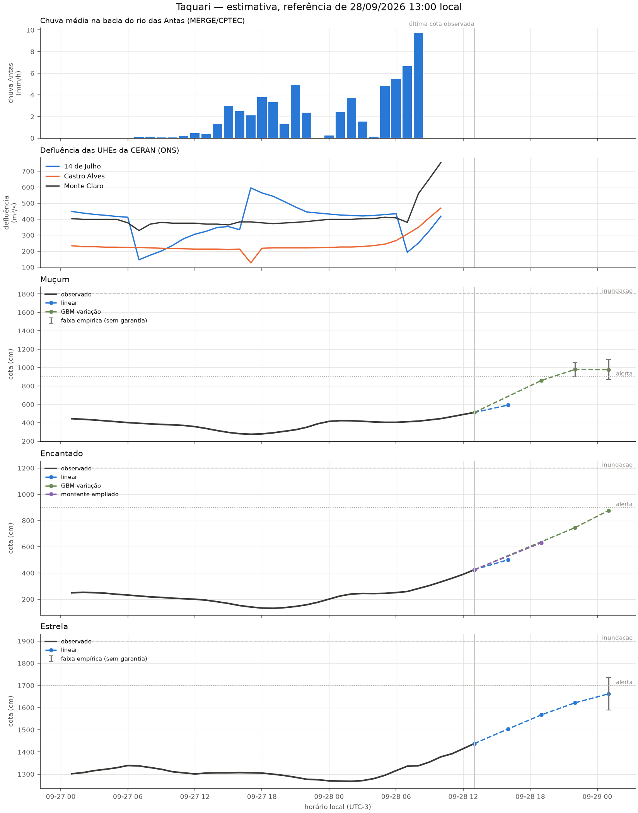

# Revisão da rodada de 28/09/2026 13:00

Modo: **emissao**. Referência observada: 28/09 13:00 (UTC−3). Emissão registrada em 28/09/2026 14:07:36 local. A antecedência real desconta o tempo desde a observação.

Horizontes contados desde a referência da própria estação; chuva e ONS mantêm seus atrasos no treino e na inferência. Alterações de modelo passam por comparação por fase da cheia. A coluna de cota é uma estimativa pontual, não uma cota de pico. Não é sistema de alerta.

| alvo      | motor          |   h | referencia_local   |   observado_cm |   previsto_cm | validade_local   |   antecedencia_real_h | status     |
|:----------|:---------------|----:|:-------------------|---------------:|--------------:|:-----------------|----------------------:|:-----------|
| Muçum     | linear         |   3 | 28/09 13:00        |            512 |         591.8 | 28/09 16:00      |                   1.9 | estimativa |
| Muçum     | gbm_delta      |   6 | 28/09 13:00        |            512 |         860.3 | 28/09 19:00      |                   4.9 | estimativa |
| Muçum     | gbm_delta      |   9 | 28/09 13:00        |            512 |         979.7 | 28/09 22:00      |                   7.9 | estimativa |
| Muçum     | gbm_delta      |  12 | 28/09 13:00        |            512 |         977.8 | 29/09 01:00      |                  10.9 | estimativa |
| Encantado | linear         |   3 | 28/09 13:00        |            425 |         500.7 | 28/09 16:00      |                   1.9 | estimativa |
| Encantado | ridge_montante |   6 | 28/09 13:00        |            425 |         630.4 | 28/09 19:00      |                   4.9 | estimativa |
| Encantado | gbm_delta      |   9 | 28/09 13:00        |            425 |         745.6 | 28/09 22:00      |                   7.9 | estimativa |
| Encantado | gbm_delta      |  12 | 28/09 13:00        |            425 |         876.2 | 29/09 01:00      |                  10.9 | estimativa |
| Estrela   | linear         |   3 | 28/09 13:00        |           1438 |        1503.5 | 28/09 16:00      |                   1.9 | estimativa |
| Estrela   | linear         |   6 | 28/09 13:00        |           1438 |        1567.3 | 28/09 19:00      |                   4.9 | estimativa |
| Estrela   | linear         |   9 | 28/09 13:00        |           1438 |        1621.5 | 28/09 22:00      |                   7.9 | estimativa |
| Estrela   | linear         |  12 | 28/09 13:00        |           1438 |        1662   | 29/09 01:00      |                  10.9 | estimativa |

## Faixas e diagnóstico

As faixas usam o quantil 90% dos erros de 2025, separado por regime, sem garantia de cobertura. Não são publicadas quando há menos de 30 pares, a velocidade está fora da calibração ou a cobertura dos últimos erros conhecidos cai abaixo de 80% (mínimo três pares nas últimas seis horas). Uma faixa ausente não significa erro zero.

| alvo      |   h | inferior_cm   | superior_cm   | faixa_status                   | cobertura_recente_pct   |   n_faixa_recente |
|:----------|----:|:--------------|:--------------|:-------------------------------|:------------------------|------------------:|
| Muçum     |   3 | —             | —             | sem calibração                 | —                       |                 0 |
| Muçum     |   6 | —             | —             | erros recentes excedem a faixa | 50.0                    |                 6 |
| Muçum     |   9 | 902.0         | 1057.4        | empírica, sem garantia         | 83.3                    |                 6 |
| Muçum     |  12 | 870.0         | 1085.5        | empírica, sem garantia         | 83.3                    |                 6 |
| Encantado |   3 | —             | —             | sem calibração                 | —                       |                 0 |
| Encantado |   6 | —             | —             | erros recentes excedem a faixa | 0.0                     |                 6 |
| Encantado |   9 | —             | —             | erros recentes excedem a faixa | 33.3                    |                 6 |
| Encantado |  12 | —             | —             | erros recentes excedem a faixa | 66.7                    |                 6 |
| Estrela   |   3 | —             | —             | sem calibração                 | —                       |                 0 |
| Estrela   |   6 | —             | —             | erros recentes excedem a faixa | 16.7                    |                 6 |
| Estrela   |   9 | —             | —             | erros recentes excedem a faixa | 50.0                    |                 6 |
| Estrela   |  12 | 1588.3        | 1735.6        | empírica, sem garantia         | 83.3                    |                 6 |

## Replay da subida

Referências a partir de 27/09 13:00; somente alvos já observados. Horizontes maiores têm menos pares. Ausência de linha significa ausência de pares, não erro zero.

| alvo      |   h |   MAE_cm |   vies_cm |   n |
|:----------|----:|---------:|----------:|----:|
| Encantado |   3 |     21.8 |     -15.1 |  22 |
| Encantado |   6 |     39.4 |     -36.3 |  19 |
| Encantado |   9 |     64.1 |     -42.7 |  16 |
| Encantado |  12 |     57.3 |     -43.4 |  13 |
| Estrela   |   3 |      9.9 |      -4.9 |  22 |
| Estrela   |   6 |     19.8 |     -14.1 |  19 |
| Estrela   |   9 |     30.2 |     -28.2 |  16 |
| Estrela   |  12 |     44.1 |     -41.2 |  13 |
| Muçum     |   3 |     23.5 |     -11.9 |  22 |
| Muçum     |   6 |     34.7 |      -6.9 |  19 |
| Muçum     |   9 |     61.6 |      -0.6 |  16 |
| Muçum     |  12 |     59   |      -1.2 |  13 |

Os candidatos são escolhidos em 2023–2024, confirmados em 2025 e podem ser vetados por regressão em 2026. A comparação completa está em [melhoria e aceitação](12_melhoria_live.md). O replay assume atrasos fixos e não recompõe a publicação real de cada fonte.

Arquivo local da execução: `data/processed/live_runs/emissao_20260928T170736212038Z`. Contém previsões, replay, features, datasets de treino, código e configuração.

## Emissões reais conferidas

| alvo      |   h |   MAE_cm |   n |
|:----------|----:|---------:|----:|
| Encantado |   3 |     33.2 |   4 |
| Encantado |   6 |    137.3 |   2 |
| Encantado |   9 |    258.6 |   2 |
| Encantado |  12 |    313.7 |   2 |
| Estrela   |   3 |     13.1 |   4 |
| Estrela   |   6 |     24.8 |   2 |
| Estrela   |   9 |     28.2 |   2 |
| Estrela   |  12 |     54.8 |   2 |
| Muçum     |   6 |    198.4 |   2 |
| Muçum     |   9 |    250.1 |   2 |
| Muçum     |  12 |    284.4 |   2 |
