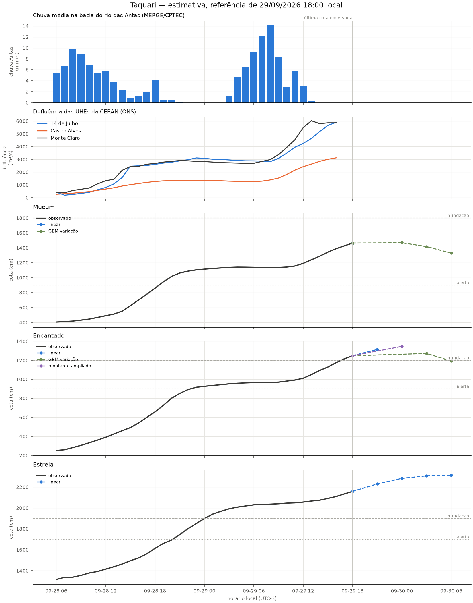

# Revisão da rodada de 29/09/2026 18:00

Modo: **emissao**. Referência observada: 29/09 18:00 (UTC−3). Emissão registrada em 29/09/2026 18:40:37 local. A antecedência real desconta o tempo desde a observação.

Horizontes contados desde a referência da própria estação; chuva e ONS mantêm seus atrasos no treino e na inferência. Alterações de modelo passam por comparação por fase da cheia. A coluna de cota é uma estimativa pontual, não uma cota de pico. Não é sistema de alerta.

| alvo      | motor          |   h | referencia_local   |   observado_cm | previsto_cm   | validade_local   |   antecedencia_real_h | status              |
|:----------|:---------------|----:|:-------------------|---------------:|:--------------|:-----------------|----------------------:|:--------------------|
| Muçum     | linear         |   3 | 29/09 18:00        |           1463 | —             | 29/09 21:00      |                   2.3 | dados_insuficientes |
| Muçum     | gbm_delta      |   6 | 29/09 18:00        |           1463 | 1467.3        | 30/09 00:00      |                   5.3 | estimativa          |
| Muçum     | gbm_delta      |   9 | 29/09 18:00        |           1463 | 1416.1        | 30/09 03:00      |                   8.3 | estimativa          |
| Muçum     | gbm_delta      |  12 | 29/09 18:00        |           1463 | 1328.8        | 30/09 06:00      |                  11.3 | estimativa          |
| Encantado | linear         |   3 | 29/09 18:00        |           1247 | 1314.1        | 29/09 21:00      |                   2.3 | estimativa          |
| Encantado | ridge_montante |   6 | 29/09 18:00        |           1247 | 1346.5        | 30/09 00:00      |                   5.3 | estimativa          |
| Encantado | gbm_delta      |   9 | 29/09 18:00        |           1247 | 1271.0        | 30/09 03:00      |                   8.3 | estimativa          |
| Encantado | gbm_delta      |  12 | 29/09 18:00        |           1247 | 1191.7        | 30/09 06:00      |                  11.3 | estimativa          |
| Estrela   | linear         |   3 | 29/09 18:00        |           2158 | 2230.0        | 29/09 21:00      |                   2.3 | estimativa          |
| Estrela   | linear         |   6 | 29/09 18:00        |           2158 | 2283.2        | 30/09 00:00      |                   5.3 | estimativa          |
| Estrela   | linear         |   9 | 29/09 18:00        |           2158 | 2307.8        | 30/09 03:00      |                   8.3 | estimativa          |
| Estrela   | linear         |  12 | 29/09 18:00        |           2158 | 2312.2        | 30/09 06:00      |                  11.3 | estimativa          |

## Faixas e diagnóstico

As faixas usam o quantil 90% dos erros de 2025, separado por regime, sem garantia de cobertura. Não são publicadas quando há menos de 30 pares, a velocidade está fora da calibração ou a cobertura dos últimos erros conhecidos cai abaixo de 80% (mínimo três pares nas últimas seis horas). Uma faixa ausente não significa erro zero.

| alvo      |   h | inferior_cm   | superior_cm   | faixa_status                   | cobertura_recente_pct   |   n_faixa_recente |
|:----------|----:|:--------------|:--------------|:-------------------------------|:------------------------|------------------:|
| Muçum     |   3 | —             | —             | faltam dados                   | —                       |                 0 |
| Muçum     |   6 | —             | —             | erros recentes excedem a faixa | 16.7                    |                 6 |
| Muçum     |   9 | —             | —             | erros recentes excedem a faixa | 0.0                     |                 6 |
| Muçum     |  12 | —             | —             | erros recentes excedem a faixa | 16.7                    |                 6 |
| Encantado |   3 | —             | —             | sem calibração                 | —                       |                 0 |
| Encantado |   6 | —             | —             | erros recentes excedem a faixa | 0.0                     |                 6 |
| Encantado |   9 | —             | —             | erros recentes excedem a faixa | 0.0                     |                 6 |
| Encantado |  12 | —             | —             | erros recentes excedem a faixa | 16.7                    |                 6 |
| Estrela   |   3 | —             | —             | sem calibração                 | —                       |                 0 |
| Estrela   |   6 | —             | —             | erros recentes excedem a faixa | 0.0                     |                 6 |
| Estrela   |   9 | —             | —             | erros recentes excedem a faixa | 50.0                    |                 6 |
| Estrela   |  12 | —             | —             | erros recentes excedem a faixa | 60.0                    |                 5 |

## Replay da subida

Referências a partir de 28/09 18:00; somente alvos já observados. Horizontes maiores têm menos pares. Ausência de linha significa ausência de pares, não erro zero.

| alvo      |   h |   MAE_cm |   vies_cm |   n |
|:----------|----:|---------:|----------:|----:|
| Encantado |   3 |     25.6 |     -13.1 |  22 |
| Encantado |   6 |     73.2 |     -27.3 |  19 |
| Encantado |   9 |    121.2 |     -43   |  16 |
| Encantado |  12 |    181.5 |     -72.7 |  13 |
| Estrela   |   3 |     11   |      -6.2 |  22 |
| Estrela   |   6 |     29.6 |     -14.7 |  19 |
| Estrela   |   9 |     49.7 |     -10.4 |  16 |
| Estrela   |  12 |     61.4 |      10.5 |  13 |
| Muçum     |   3 |     30.3 |     -16   |  22 |
| Muçum     |   6 |     94   |      33.2 |  19 |
| Muçum     |   9 |    172.9 |      -9.2 |  16 |
| Muçum     |  12 |    252.8 |      -7.7 |  13 |

Os candidatos são escolhidos em 2023–2024, confirmados em 2025 e podem ser vetados por regressão em 2026. A comparação completa está em [melhoria e aceitação](12_melhoria_live.md). O replay assume atrasos fixos e não recompõe a publicação real de cada fonte.

Arquivo local da execução: `data/processed/live_runs/emissao_20260929T214037055676Z`. Contém previsões, replay, features, datasets de treino, código e configuração.

## Emissões reais conferidas

| alvo      |   h |   MAE_cm |   n |
|:----------|----:|---------:|----:|
| Encantado |   3 |     39.2 |  21 |
| Encantado |   6 |    136.8 |  18 |
| Encantado |   9 |    175.2 |  15 |
| Encantado |  12 |    194.3 |  13 |
| Estrela   |   3 |     19.7 |  21 |
| Estrela   |   6 |     61.4 |  18 |
| Estrela   |   9 |    113.1 |  15 |
| Estrela   |  12 |    161.8 |  13 |
| Muçum     |   3 |     54.7 |   4 |
| Muçum     |   6 |    129   |  18 |
| Muçum     |   9 |    222.2 |  15 |
| Muçum     |  12 |    251.9 |  13 |
