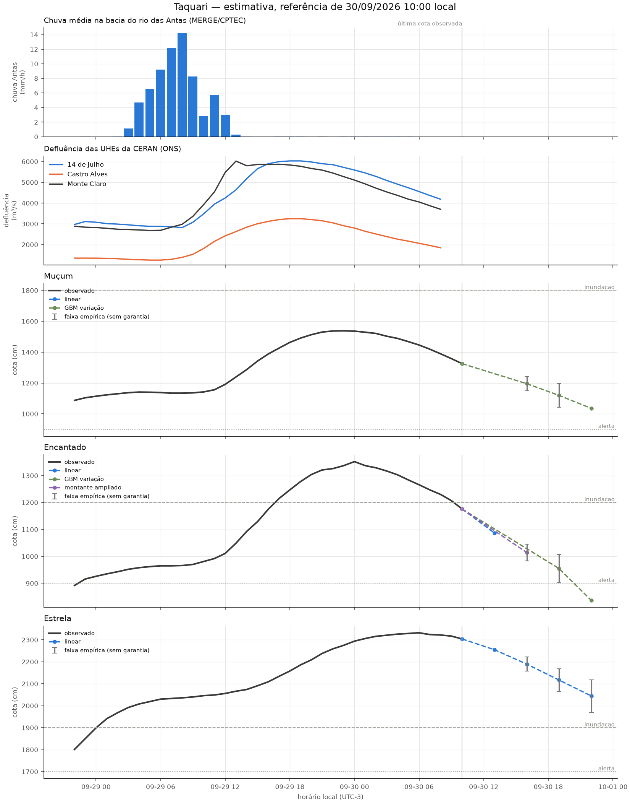

# Revisão da rodada de 30/09/2026 10:00

Modo: **emissao**. Referência observada: 30/09 10:00 (UTC−3). Emissão registrada em 30/09/2026 10:45:05 local. A antecedência real desconta o tempo desde a observação.

Horizontes contados desde a referência da própria estação; chuva e ONS mantêm seus atrasos no treino e na inferência. Alterações de modelo passam por comparação por fase da cheia. A coluna de cota é uma estimativa pontual, não uma cota de pico. Não é sistema de alerta.

| alvo      | motor          |   h | referencia_local   |   observado_cm | previsto_cm   | validade_local   |   antecedencia_real_h | status              |
|:----------|:---------------|----:|:-------------------|---------------:|:--------------|:-----------------|----------------------:|:--------------------|
| Muçum     | linear         |   3 | 30/09 10:00        |           1325 | —             | 30/09 13:00      |                   2.2 | dados_insuficientes |
| Muçum     | gbm_delta      |   6 | 30/09 10:00        |           1325 | 1195.3        | 30/09 16:00      |                   5.2 | estimativa          |
| Muçum     | gbm_delta      |   9 | 30/09 10:00        |           1325 | 1119.5        | 30/09 19:00      |                   8.2 | estimativa          |
| Muçum     | gbm_delta      |  12 | 30/09 10:00        |           1325 | 1035.0        | 30/09 22:00      |                  11.2 | estimativa          |
| Encantado | linear         |   3 | 30/09 10:00        |           1176 | 1086.7        | 30/09 13:00      |                   2.2 | estimativa          |
| Encantado | ridge_montante |   6 | 30/09 10:00        |           1176 | 1014.5        | 30/09 16:00      |                   5.2 | estimativa          |
| Encantado | gbm_delta      |   9 | 30/09 10:00        |           1176 | 954.9         | 30/09 19:00      |                   8.2 | estimativa          |
| Encantado | gbm_delta      |  12 | 30/09 10:00        |           1176 | 836.3         | 30/09 22:00      |                  11.2 | estimativa          |
| Estrela   | linear         |   3 | 30/09 10:00        |           2304 | 2255.0        | 30/09 13:00      |                   2.2 | estimativa          |
| Estrela   | linear         |   6 | 30/09 10:00        |           2304 | 2189.6        | 30/09 16:00      |                   5.2 | estimativa          |
| Estrela   | linear         |   9 | 30/09 10:00        |           2304 | 2116.9        | 30/09 19:00      |                   8.2 | estimativa          |
| Estrela   | linear         |  12 | 30/09 10:00        |           2304 | 2044.2        | 30/09 22:00      |                  11.2 | estimativa          |

## Faixas e diagnóstico

As faixas usam o quantil 90% dos erros de 2025, separado por regime, sem garantia de cobertura. Não são publicadas quando há menos de 30 pares, a velocidade está fora da calibração ou a cobertura dos últimos erros conhecidos cai abaixo de 80% (mínimo três pares nas últimas seis horas). Uma faixa ausente não significa erro zero.

| alvo      |   h | inferior_cm   | superior_cm   | faixa_status                   | cobertura_recente_pct   |   n_faixa_recente |
|:----------|----:|:--------------|:--------------|:-------------------------------|:------------------------|------------------:|
| Muçum     |   3 | —             | —             | faltam dados                   | —                       |                 0 |
| Muçum     |   6 | 1149.3        | 1241.2        | empírica, sem garantia         | 100.0                   |                 6 |
| Muçum     |   9 | 1043.2        | 1195.9        | empírica, sem garantia         | 100.0                   |                 6 |
| Muçum     |  12 | —             | —             | erros recentes excedem a faixa | 66.7                    |                 6 |
| Encantado |   3 | —             | —             | sem calibração                 | —                       |                 0 |
| Encantado |   6 | 982.9         | 1046.1        | empírica, sem garantia         | 83.3                    |                 6 |
| Encantado |   9 | 902.4         | 1007.4        | empírica, sem garantia         | 83.3                    |                 6 |
| Encantado |  12 | —             | —             | erros recentes excedem a faixa | 66.7                    |                 6 |
| Estrela   |   3 | —             | —             | sem calibração                 | —                       |                 0 |
| Estrela   |   6 | 2157.4        | 2221.7        | empírica, sem garantia         | 100.0                   |                 6 |
| Estrela   |   9 | 2065.3        | 2168.6        | empírica, sem garantia         | 100.0                   |                 6 |
| Estrela   |  12 | 1970.6        | 2117.9        | empírica, sem garantia         | 100.0                   |                 6 |

## Replay da subida

Referências a partir de 29/09 10:00; somente alvos já observados. Horizontes maiores têm menos pares. Ausência de linha significa ausência de pares, não erro zero.

| alvo      |   h |   MAE_cm |   vies_cm |   n |
|:----------|----:|---------:|----------:|----:|
| Encantado |   3 |     20.2 |      -6.4 |  22 |
| Encantado |   6 |     41.7 |       7.8 |  19 |
| Encantado |   9 |    109.9 |      98.5 |  16 |
| Encantado |  12 |    142.7 |     124.7 |  13 |
| Estrela   |   3 |      9.3 |      -7.6 |  22 |
| Estrela   |   6 |     25.5 |     -21.3 |  19 |
| Estrela   |   9 |     51.6 |     -41.7 |  16 |
| Estrela   |  12 |     84.7 |     -74.5 |  13 |
| Muçum     |   3 |     26.1 |      -4.1 |  22 |
| Muçum     |   6 |     99.3 |      98.1 |  19 |
| Muçum     |   9 |    126.4 |     120.3 |  16 |
| Muçum     |  12 |    186.8 |     186.2 |  13 |

Os candidatos são escolhidos em 2023–2024, confirmados em 2025 e podem ser vetados por regressão em 2026. A comparação completa está em [melhoria e aceitação](12_melhoria_live.md). O replay assume atrasos fixos e não recompõe a publicação real de cada fonte.

Arquivo local da execução: `data/processed/live_runs/emissao_20260930T134505876340Z`. Contém previsões, replay, features, datasets de treino, código e configuração.

## Emissões reais conferidas

| alvo      |   h |   MAE_cm |   n |
|:----------|----:|---------:|----:|
| Encantado |   3 |     33.9 |  25 |
| Encantado |   6 |    109.8 |  24 |
| Encantado |   9 |    131   |  24 |
| Encantado |  12 |    169.4 |  24 |
| Estrela   |   3 |     18.1 |  26 |
| Estrela   |   6 |     52.9 |  24 |
| Estrela   |   9 |     99.6 |  24 |
| Estrela   |  12 |    149   |  24 |
| Muçum     |   3 |     47.9 |   5 |
| Muçum     |   6 |    115.8 |  24 |
| Muçum     |   9 |    187.6 |  24 |
| Muçum     |  12 |    228.8 |  24 |
