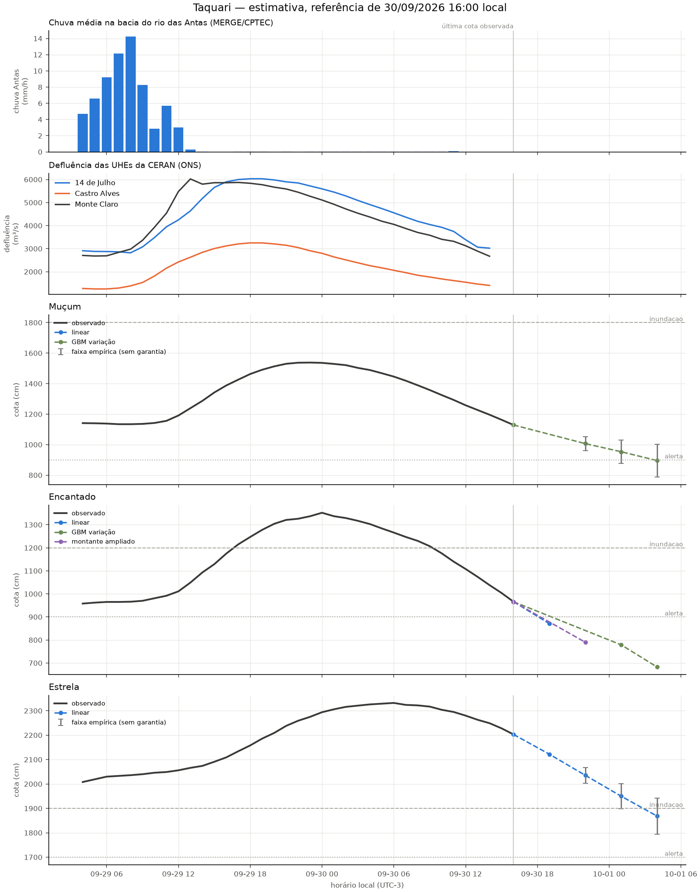

# Revisão da rodada de 30/09/2026 16:00

Modo: **emissao**. Referência observada: 30/09 16:00 (UTC−3). Emissão registrada em 30/09/2026 16:40:34 local. A antecedência real desconta o tempo desde a observação.

Horizontes contados desde a referência da própria estação; chuva e ONS mantêm seus atrasos no treino e na inferência. Alterações de modelo passam por comparação por fase da cheia. A coluna de cota é uma estimativa pontual, não uma cota de pico. Não é sistema de alerta.

| alvo      | motor          |   h | referencia_local   |   observado_cm | previsto_cm   | validade_local   |   antecedencia_real_h | status              |
|:----------|:---------------|----:|:-------------------|---------------:|:--------------|:-----------------|----------------------:|:--------------------|
| Muçum     | linear         |   3 | 30/09 16:00        |           1129 | —             | 30/09 19:00      |                   2.3 | dados_insuficientes |
| Muçum     | gbm_delta      |   6 | 30/09 16:00        |           1129 | 1006.6        | 30/09 22:00      |                   5.3 | estimativa          |
| Muçum     | gbm_delta      |   9 | 30/09 16:00        |           1129 | 953.4         | 01/10 01:00      |                   8.3 | estimativa          |
| Muçum     | gbm_delta      |  12 | 30/09 16:00        |           1129 | 895.5         | 01/10 04:00      |                  11.3 | estimativa          |
| Encantado | linear         |   3 | 30/09 16:00        |            966 | 870.7         | 30/09 19:00      |                   2.3 | estimativa          |
| Encantado | ridge_montante |   6 | 30/09 16:00        |            966 | 790.1         | 30/09 22:00      |                   5.3 | estimativa          |
| Encantado | gbm_delta      |   9 | 30/09 16:00        |            966 | 778.8         | 01/10 01:00      |                   8.3 | estimativa          |
| Encantado | gbm_delta      |  12 | 30/09 16:00        |            966 | 682.7         | 01/10 04:00      |                  11.3 | estimativa          |
| Estrela   | linear         |   3 | 30/09 16:00        |           2203 | 2121.8        | 30/09 19:00      |                   2.3 | estimativa          |
| Estrela   | linear         |   6 | 30/09 16:00        |           2203 | 2035.4        | 30/09 22:00      |                   5.3 | estimativa          |
| Estrela   | linear         |   9 | 30/09 16:00        |           2203 | 1949.9        | 01/10 01:00      |                   8.3 | estimativa          |
| Estrela   | linear         |  12 | 30/09 16:00        |           2203 | 1868.3        | 01/10 04:00      |                  11.3 | estimativa          |

## Faixas e diagnóstico

As faixas usam o quantil 90% dos erros de 2025, separado por regime, sem garantia de cobertura. Não são publicadas quando há menos de 30 pares, a velocidade está fora da calibração ou a cobertura dos últimos erros conhecidos cai abaixo de 80% (mínimo três pares nas últimas seis horas). Uma faixa ausente não significa erro zero.

| alvo      |   h | inferior_cm   | superior_cm   | faixa_status              | cobertura_recente_pct   |   n_faixa_recente |
|:----------|----:|:--------------|:--------------|:--------------------------|:------------------------|------------------:|
| Muçum     |   3 | —             | —             | faltam dados              | —                       |                 0 |
| Muçum     |   6 | 960.7         | 1052.6        | empírica, sem garantia    | 100.0                   |                 6 |
| Muçum     |   9 | 877.0         | 1029.8        | empírica, sem garantia    | 100.0                   |                 6 |
| Muçum     |  12 | 788.9         | 1002.0        | empírica, sem garantia    | 100.0                   |                 6 |
| Encantado |   3 | —             | —             | sem calibração            | —                       |                 0 |
| Encantado |   6 | —             | —             | subida fora da calibração | 50.0                    |                 6 |
| Encantado |   9 | —             | —             | subida fora da calibração | 83.3                    |                 6 |
| Encantado |  12 | —             | —             | subida fora da calibração | 100.0                   |                 6 |
| Estrela   |   3 | —             | —             | sem calibração            | —                       |                 0 |
| Estrela   |   6 | 2003.3        | 2067.6        | empírica, sem garantia    | 100.0                   |                 6 |
| Estrela   |   9 | 1898.2        | 2001.5        | empírica, sem garantia    | 100.0                   |                 6 |
| Estrela   |  12 | 1794.6        | 1941.9        | empírica, sem garantia    | 100.0                   |                 6 |

## Replay da subida

Referências a partir de 29/09 16:00; somente alvos já observados. Horizontes maiores têm menos pares. Ausência de linha significa ausência de pares, não erro zero.

| alvo      |   h |   MAE_cm |   vies_cm |   n |
|:----------|----:|---------:|----------:|----:|
| Encantado |   3 |     14.8 |       9.9 |  22 |
| Encantado |   6 |     31.7 |      31.1 |  19 |
| Encantado |   9 |     61.8 |      25.2 |  16 |
| Encantado |  12 |     82.8 |      41.6 |  13 |
| Estrela   |   3 |      6.7 |      -4.5 |  22 |
| Estrela   |   6 |     12.6 |      -7.6 |  19 |
| Estrela   |   9 |     17.3 |      -7.2 |  16 |
| Estrela   |  12 |     22.5 |       0.4 |  13 |
| Muçum     |   3 |     14.4 |      14.4 |  22 |
| Muçum     |   6 |     37.6 |      29.6 |  19 |
| Muçum     |   9 |     42.3 |      20   |  16 |
| Muçum     |  12 |     75.4 |      66.8 |  13 |

Os candidatos são escolhidos em 2023–2024, confirmados em 2025 e podem ser vetados por regressão em 2026. A comparação completa está em [melhoria e aceitação](12_melhoria_live.md). O replay assume atrasos fixos e não recompõe a publicação real de cada fonte.

Arquivo local da execução: `data/processed/live_runs/emissao_20260930T194034386647Z`. Contém previsões, replay, features, datasets de treino, código e configuração.

## Emissões reais conferidas

| alvo      |   h |   MAE_cm |   n |
|:----------|----:|---------:|----:|
| Encantado |   3 |     31.2 |  31 |
| Encantado |   6 |    103.3 |  28 |
| Encantado |   9 |    128.7 |  26 |
| Encantado |  12 |    169.4 |  24 |
| Estrela   |   3 |     15.7 |  32 |
| Estrela   |   6 |     46   |  29 |
| Estrela   |   9 |     93   |  26 |
| Estrela   |  12 |    149   |  24 |
| Muçum     |   3 |     47.9 |   5 |
| Muçum     |   6 |    105.3 |  29 |
| Muçum     |   9 |    174.6 |  26 |
| Muçum     |  12 |    228.8 |  24 |
