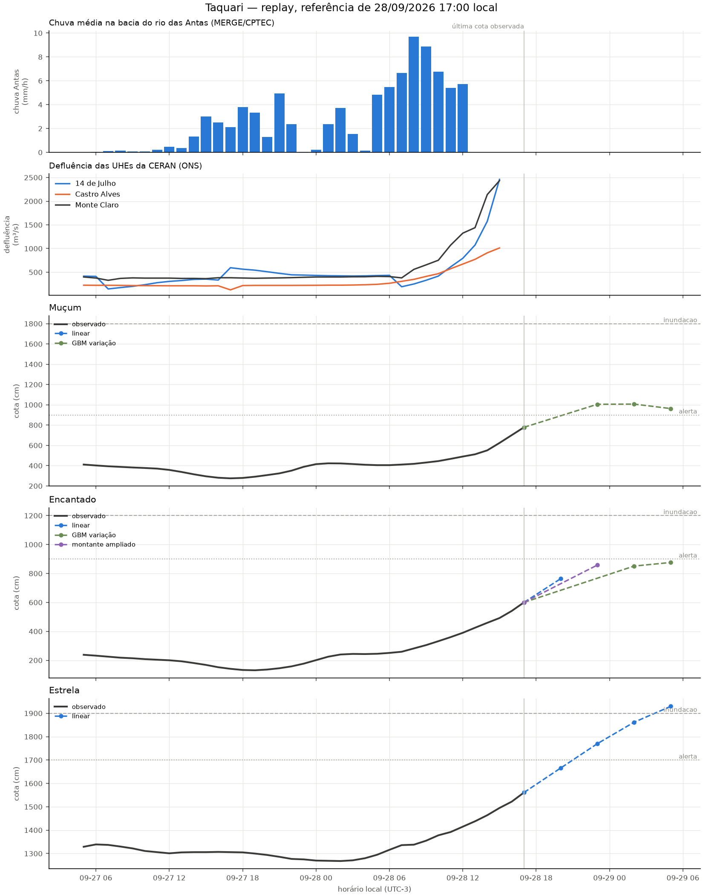

# Revisão da rodada de 28/09/2026 17:00

Modo: **emissao**. Referência observada: 28/09 17:00 (UTC−3). Emissão registrada em 28/09/2026 17:38:56 local. A antecedência real desconta o tempo desde a observação.

Horizontes contados desde a referência da própria estação; chuva e ONS mantêm seus atrasos no treino e na inferência. Alterações de modelo passam por comparação por fase da cheia. A coluna de cota é uma estimativa pontual, não uma cota de pico. Não é sistema de alerta.

| alvo      | motor          |   h | referencia_local   |   observado_cm | previsto_cm   | validade_local   |   antecedencia_real_h | status              |
|:----------|:---------------|----:|:-------------------|---------------:|:--------------|:-----------------|----------------------:|:--------------------|
| Muçum     | linear         |   3 | 28/09 17:00        |            778 | —             | 28/09 20:00      |                   2.4 | dados_insuficientes |
| Muçum     | gbm_delta      |   6 | 28/09 17:00        |            778 | 1006.1        | 28/09 23:00      |                   5.4 | estimativa          |
| Muçum     | gbm_delta      |   9 | 28/09 17:00        |            778 | 983.6         | 29/09 02:00      |                   8.4 | estimativa          |
| Muçum     | gbm_delta      |  12 | 28/09 17:00        |            778 | 969.5         | 29/09 05:00      |                  11.4 | estimativa          |
| Encantado | linear         |   3 | 28/09 17:00        |            600 | 763.9         | 28/09 20:00      |                   2.4 | estimativa          |
| Encantado | ridge_montante |   6 | 28/09 17:00        |            600 | 858.4         | 28/09 23:00      |                   5.4 | estimativa          |
| Encantado | gbm_delta      |   9 | 28/09 17:00        |            600 | 844.6         | 29/09 02:00      |                   8.4 | estimativa          |
| Encantado | gbm_delta      |  12 | 28/09 17:00        |            600 | 870.7         | 29/09 05:00      |                  11.4 | estimativa          |
| Estrela   | linear         |   3 | 28/09 17:00        |           1561 | 1665.7        | 28/09 20:00      |                   2.4 | estimativa          |
| Estrela   | linear         |   6 | 28/09 17:00        |           1561 | 1770.1        | 28/09 23:00      |                   5.4 | estimativa          |
| Estrela   | linear         |   9 | 28/09 17:00        |           1561 | 1862.1        | 29/09 02:00      |                   8.4 | estimativa          |
| Estrela   | linear         |  12 | 28/09 17:00        |           1561 | 1930.5        | 29/09 05:00      |                  11.4 | estimativa          |

## Faixas e diagnóstico

As faixas usam o quantil 90% dos erros de 2025, separado por regime, sem garantia de cobertura. Não são publicadas quando há menos de 30 pares, a velocidade está fora da calibração ou a cobertura dos últimos erros conhecidos cai abaixo de 80% (mínimo três pares nas últimas seis horas). Uma faixa ausente não significa erro zero.

| alvo      |   h | inferior_cm   | superior_cm   | faixa_status                   | cobertura_recente_pct   |   n_faixa_recente |
|:----------|----:|:--------------|:--------------|:-------------------------------|:------------------------|------------------:|
| Muçum     |   3 | —             | —             | faltam dados                   | —                       |                 0 |
| Muçum     |   6 | —             | —             | erros recentes excedem a faixa | 16.7                    |                 6 |
| Muçum     |   9 | —             | —             | erros recentes excedem a faixa | 16.7                    |                 6 |
| Muçum     |  12 | —             | —             | erros recentes excedem a faixa | 50.0                    |                 6 |
| Encantado |   3 | —             | —             | sem calibração                 | —                       |                 0 |
| Encantado |   6 | —             | —             | erros recentes excedem a faixa | 0.0                     |                 6 |
| Encantado |   9 | —             | —             | erros recentes excedem a faixa | 0.0                     |                 6 |
| Encantado |  12 | —             | —             | erros recentes excedem a faixa | 0.0                     |                 6 |
| Estrela   |   3 | —             | —             | sem calibração                 | —                       |                 0 |
| Estrela   |   6 | —             | —             | poucos exemplos neste regime   | 0.0                     |                 6 |
| Estrela   |   9 | —             | —             | poucos exemplos neste regime   | 0.0                     |                 6 |
| Estrela   |  12 | —             | —             | poucos exemplos neste regime   | 33.3                    |                 6 |

## Replay da subida

Referências a partir de 27/09 17:00; somente alvos já observados. Horizontes maiores têm menos pares. Ausência de linha significa ausência de pares, não erro zero.

| alvo      |   h |   MAE_cm |   vies_cm |   n |
|:----------|----:|---------:|----------:|----:|
| Encantado |   3 |     27.9 |     -22.2 |  22 |
| Encantado |   6 |     69.4 |     -69.4 |  19 |
| Encantado |   9 |     95.7 |     -80.9 |  16 |
| Encantado |  12 |    111   |     -97.1 |  13 |
| Estrela   |   3 |     13   |      -8   |  22 |
| Estrela   |   6 |     31.3 |     -25.6 |  19 |
| Estrela   |   9 |     55.8 |     -55.5 |  16 |
| Estrela   |  12 |     94.7 |     -94.7 |  13 |
| Muçum     |   3 |     37.7 |     -30.6 |  22 |
| Muçum     |   6 |     58.8 |     -36.7 |  19 |
| Muçum     |   9 |     89.2 |     -31.4 |  16 |
| Muçum     |  12 |     94.1 |     -36.3 |  13 |

Os candidatos são escolhidos em 2023–2024, confirmados em 2025 e podem ser vetados por regressão em 2026. A comparação completa está em [melhoria e aceitação](12_melhoria_live.md). O replay assume atrasos fixos e não recompõe a publicação real de cada fonte.

Arquivo local da execução: `data/processed/live_runs/emissao_20260928T203856208123Z`. Contém previsões, replay, features, datasets de treino, código e configuração.

## Emissões reais conferidas

| alvo      |   h |   MAE_cm |   n |
|:----------|----:|---------:|----:|
| Encantado |   3 |     38.5 |   7 |
| Encantado |   6 |    117   |   4 |
| Encantado |   9 |    258.6 |   2 |
| Encantado |  12 |    313.7 |   2 |
| Estrela   |   3 |     16.2 |   7 |
| Estrela   |   6 |     39.2 |   4 |
| Estrela   |   9 |     28.2 |   2 |
| Estrela   |  12 |     54.8 |   2 |
| Muçum     |   3 |    109.2 |   1 |
| Muçum     |   6 |    155.2 |   4 |
| Muçum     |   9 |    250.1 |   2 |
| Muçum     |  12 |    284.4 |   2 |
