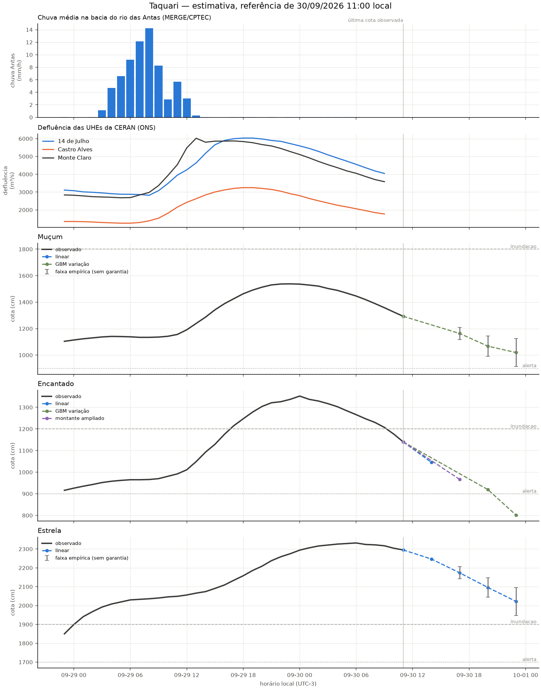

# Revisão da rodada de 30/09/2026 11:00

Modo: **emissao**. Referência observada: 30/09 11:00 (UTC−3). Emissão registrada em 30/09/2026 11:40:26 local. A antecedência real desconta o tempo desde a observação.

Horizontes contados desde a referência da própria estação; chuva e ONS mantêm seus atrasos no treino e na inferência. Alterações de modelo passam por comparação por fase da cheia. A coluna de cota é uma estimativa pontual, não uma cota de pico. Não é sistema de alerta.

| alvo      | motor          |   h | referencia_local   |   observado_cm | previsto_cm   | validade_local   |   antecedencia_real_h | status              |
|:----------|:---------------|----:|:-------------------|---------------:|:--------------|:-----------------|----------------------:|:--------------------|
| Muçum     | linear         |   3 | 30/09 11:00        |           1293 | —             | 30/09 14:00      |                   2.3 | dados_insuficientes |
| Muçum     | gbm_delta      |   6 | 30/09 11:00        |           1293 | 1163.0        | 30/09 17:00      |                   5.3 | estimativa          |
| Muçum     | gbm_delta      |   9 | 30/09 11:00        |           1293 | 1067.0        | 30/09 20:00      |                   8.3 | estimativa          |
| Muçum     | gbm_delta      |  12 | 30/09 11:00        |           1293 | 1019.2        | 30/09 23:00      |                  11.3 | estimativa          |
| Encantado | linear         |   3 | 30/09 11:00        |           1140 | 1045.0        | 30/09 14:00      |                   2.3 | estimativa          |
| Encantado | ridge_montante |   6 | 30/09 11:00        |           1140 | 966.6         | 30/09 17:00      |                   5.3 | estimativa          |
| Encantado | gbm_delta      |   9 | 30/09 11:00        |           1140 | 919.3         | 30/09 20:00      |                   8.3 | estimativa          |
| Encantado | gbm_delta      |  12 | 30/09 11:00        |           1140 | 800.9         | 30/09 23:00      |                  11.3 | estimativa          |
| Estrela   | linear         |   3 | 30/09 11:00        |           2295 | 2246.7        | 30/09 14:00      |                   2.3 | estimativa          |
| Estrela   | linear         |   6 | 30/09 11:00        |           2295 | 2173.5        | 30/09 17:00      |                   5.3 | estimativa          |
| Estrela   | linear         |   9 | 30/09 11:00        |           2295 | 2095.8        | 30/09 20:00      |                   8.3 | estimativa          |
| Estrela   | linear         |  12 | 30/09 11:00        |           2295 | 2021.7        | 30/09 23:00      |                  11.3 | estimativa          |

## Faixas e diagnóstico

As faixas usam o quantil 90% dos erros de 2025, separado por regime, sem garantia de cobertura. Não são publicadas quando há menos de 30 pares, a velocidade está fora da calibração ou a cobertura dos últimos erros conhecidos cai abaixo de 80% (mínimo três pares nas últimas seis horas). Uma faixa ausente não significa erro zero.

| alvo      |   h | inferior_cm   | superior_cm   | faixa_status              | cobertura_recente_pct   |   n_faixa_recente |
|:----------|----:|:--------------|:--------------|:--------------------------|:------------------------|------------------:|
| Muçum     |   3 | —             | —             | faltam dados              | —                       |                 0 |
| Muçum     |   6 | 1117.0        | 1209.0        | empírica, sem garantia    | 100.0                   |                 6 |
| Muçum     |   9 | 990.7         | 1143.4        | empírica, sem garantia    | 100.0                   |                 6 |
| Muçum     |  12 | 912.6         | 1125.7        | empírica, sem garantia    | 83.3                    |                 6 |
| Encantado |   3 | —             | —             | sem calibração            | —                       |                 0 |
| Encantado |   6 | —             | —             | subida fora da calibração | 83.3                    |                 6 |
| Encantado |   9 | —             | —             | subida fora da calibração | 83.3                    |                 6 |
| Encantado |  12 | —             | —             | subida fora da calibração | 83.3                    |                 6 |
| Estrela   |   3 | —             | —             | sem calibração            | —                       |                 0 |
| Estrela   |   6 | 2141.4        | 2205.7        | empírica, sem garantia    | 100.0                   |                 6 |
| Estrela   |   9 | 2044.1        | 2147.4        | empírica, sem garantia    | 100.0                   |                 6 |
| Estrela   |  12 | 1948.0        | 2095.3        | empírica, sem garantia    | 100.0                   |                 6 |

## Replay da subida

Referências a partir de 29/09 11:00; somente alvos já observados. Horizontes maiores têm menos pares. Ausência de linha significa ausência de pares, não erro zero.

| alvo      |   h |   MAE_cm |   vies_cm |   n |
|:----------|----:|---------:|----------:|----:|
| Encantado |   3 |     19.5 |      -2.9 |  22 |
| Encantado |   6 |     33.8 |      16.3 |  19 |
| Encantado |   9 |    110   |      98.4 |  16 |
| Encantado |  12 |    140.8 |     128   |  13 |
| Estrela   |   3 |      8.8 |      -7   |  22 |
| Estrela   |   6 |     24   |     -19.8 |  19 |
| Estrela   |   9 |     44.6 |     -34.7 |  16 |
| Estrela   |  12 |     69.5 |     -56.8 |  13 |
| Muçum     |   3 |     22.1 |       1.1 |  22 |
| Muçum     |   6 |     99.4 |      94.9 |  19 |
| Muçum     |   9 |    122.1 |     115.9 |  16 |
| Muçum     |  12 |    187.1 |     186.6 |  13 |

Os candidatos são escolhidos em 2023–2024, confirmados em 2025 e podem ser vetados por regressão em 2026. A comparação completa está em [melhoria e aceitação](12_melhoria_live.md). O replay assume atrasos fixos e não recompõe a publicação real de cada fonte.

Arquivo local da execução: `data/processed/live_runs/emissao_20260930T144026594208Z`. Contém previsões, replay, features, datasets de treino, código e configuração.

## Emissões reais conferidas

| alvo      |   h |   MAE_cm |   n |
|:----------|----:|---------:|----:|
| Encantado |   3 |     33.8 |  26 |
| Encantado |   6 |    109.8 |  24 |
| Encantado |   9 |    131   |  24 |
| Encantado |  12 |    169.4 |  24 |
| Estrela   |   3 |     17.4 |  27 |
| Estrela   |   6 |     52.9 |  24 |
| Estrela   |   9 |     99.6 |  24 |
| Estrela   |  12 |    149   |  24 |
| Muçum     |   3 |     47.9 |   5 |
| Muçum     |   6 |    115.8 |  24 |
| Muçum     |   9 |    187.6 |  24 |
| Muçum     |  12 |    228.8 |  24 |
