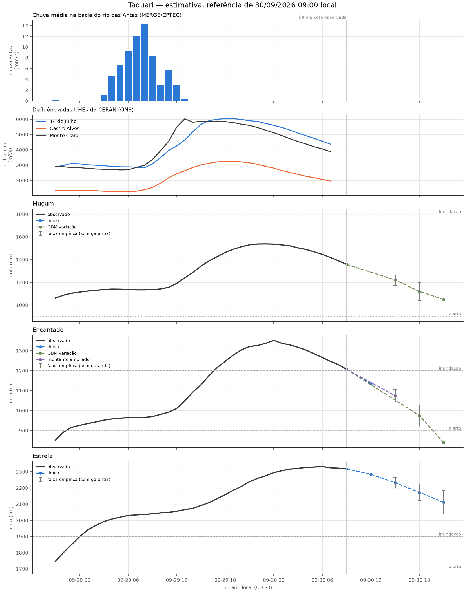

# Revisão da rodada de 30/09/2026 09:00

Modo: **emissao**. Referência observada: 30/09 09:00 (UTC−3). Emissão registrada em 30/09/2026 09:40:35 local. A antecedência real desconta o tempo desde a observação.

Horizontes contados desde a referência da própria estação; chuva e ONS mantêm seus atrasos no treino e na inferência. Alterações de modelo passam por comparação por fase da cheia. A coluna de cota é uma estimativa pontual, não uma cota de pico. Não é sistema de alerta.

| alvo      | motor          |   h | referencia_local   |   observado_cm | previsto_cm   | validade_local   |   antecedencia_real_h | status              |
|:----------|:---------------|----:|:-------------------|---------------:|:--------------|:-----------------|----------------------:|:--------------------|
| Muçum     | linear         |   3 | 30/09 09:00        |           1358 | —             | 30/09 12:00      |                   2.3 | dados_insuficientes |
| Muçum     | gbm_delta      |   6 | 30/09 09:00        |           1358 | 1221.0        | 30/09 15:00      |                   5.3 | estimativa          |
| Muçum     | gbm_delta      |   9 | 30/09 09:00        |           1358 | 1119.8        | 30/09 18:00      |                   8.3 | estimativa          |
| Muçum     | gbm_delta      |  12 | 30/09 09:00        |           1358 | 1050.2        | 30/09 21:00      |                  11.3 | estimativa          |
| Encantado | linear         |   3 | 30/09 09:00        |           1207 | 1135.2        | 30/09 12:00      |                   2.3 | estimativa          |
| Encantado | ridge_montante |   6 | 30/09 09:00        |           1207 | 1074.9        | 30/09 15:00      |                   5.3 | estimativa          |
| Encantado | gbm_delta      |   9 | 30/09 09:00        |           1207 | 975.5         | 30/09 18:00      |                   8.3 | estimativa          |
| Encantado | gbm_delta      |  12 | 30/09 09:00        |           1207 | 839.3         | 30/09 21:00      |                  11.3 | estimativa          |
| Estrela   | linear         |   3 | 30/09 09:00        |           2317 | 2284.3        | 30/09 12:00      |                   2.3 | estimativa          |
| Estrela   | linear         |   6 | 30/09 09:00        |           2317 | 2232.0        | 30/09 15:00      |                   5.3 | estimativa          |
| Estrela   | linear         |   9 | 30/09 09:00        |           2317 | 2172.5        | 30/09 18:00      |                   8.3 | estimativa          |
| Estrela   | linear         |  12 | 30/09 09:00        |           2317 | 2111.4        | 30/09 21:00      |                  11.3 | estimativa          |

## Faixas e diagnóstico

As faixas usam o quantil 90% dos erros de 2025, separado por regime, sem garantia de cobertura. Não são publicadas quando há menos de 30 pares, a velocidade está fora da calibração ou a cobertura dos últimos erros conhecidos cai abaixo de 80% (mínimo três pares nas últimas seis horas). Uma faixa ausente não significa erro zero.

| alvo      |   h | inferior_cm   | superior_cm   | faixa_status                   | cobertura_recente_pct   |   n_faixa_recente |
|:----------|----:|:--------------|:--------------|:-------------------------------|:------------------------|------------------:|
| Muçum     |   3 | —             | —             | faltam dados                   | —                       |                 0 |
| Muçum     |   6 | 1175.1        | 1267.0        | empírica, sem garantia         | 100.0                   |                 6 |
| Muçum     |   9 | 1043.4        | 1196.1        | empírica, sem garantia         | 100.0                   |                 6 |
| Muçum     |  12 | —             | —             | erros recentes excedem a faixa | 50.0                    |                 6 |
| Encantado |   3 | —             | —             | sem calibração                 | —                       |                 0 |
| Encantado |   6 | 1043.3        | 1106.5        | empírica, sem garantia         | 83.3                    |                 6 |
| Encantado |   9 | 923.0         | 1027.9        | empírica, sem garantia         | 83.3                    |                 6 |
| Encantado |  12 | —             | —             | erros recentes excedem a faixa | 50.0                    |                 6 |
| Estrela   |   3 | —             | —             | sem calibração                 | —                       |                 0 |
| Estrela   |   6 | 2199.9        | 2264.1        | empírica, sem garantia         | 100.0                   |                 6 |
| Estrela   |   9 | 2120.9        | 2224.1        | empírica, sem garantia         | 100.0                   |                 6 |
| Estrela   |  12 | 2037.8        | 2185.1        | empírica, sem garantia         | 100.0                   |                 6 |

## Replay da subida

Referências a partir de 29/09 09:00; somente alvos já observados. Horizontes maiores têm menos pares. Ausência de linha significa ausência de pares, não erro zero.

| alvo      |   h |   MAE_cm |   vies_cm |   n |
|:----------|----:|---------:|----------:|----:|
| Encantado |   3 |     21.3 |      -8.6 |  22 |
| Encantado |   6 |     50.7 |      -3.2 |  19 |
| Encantado |   9 |    117.2 |      91.2 |  16 |
| Encantado |  12 |    162.3 |     105.1 |  13 |
| Estrela   |   3 |      9.1 |      -7.4 |  22 |
| Estrela   |   6 |     27.4 |     -23.2 |  19 |
| Estrela   |   9 |     57.4 |     -47.5 |  16 |
| Estrela   |  12 |    101.5 |     -91.4 |  13 |
| Muçum     |   3 |     28.7 |      -8.3 |  22 |
| Muçum     |   6 |    106.4 |      89.8 |  19 |
| Muçum     |   9 |    142.7 |     104   |  16 |
| Muçum     |  12 |    212.5 |     160.5 |  13 |

Os candidatos são escolhidos em 2023–2024, confirmados em 2025 e podem ser vetados por regressão em 2026. A comparação completa está em [melhoria e aceitação](12_melhoria_live.md). O replay assume atrasos fixos e não recompõe a publicação real de cada fonte.

Arquivo local da execução: `data/processed/live_runs/emissao_20260930T124035217410Z`. Contém previsões, replay, features, datasets de treino, código e configuração.

## Emissões reais conferidas

| alvo      |   h |   MAE_cm |   n |
|:----------|----:|---------:|----:|
| Encantado |   3 |     34.9 |  24 |
| Encantado |   6 |    109.8 |  24 |
| Encantado |   9 |    131   |  24 |
| Encantado |  12 |    169.4 |  24 |
| Estrela   |   3 |     18.2 |  24 |
| Estrela   |   6 |     52.9 |  24 |
| Estrela   |   9 |     99.6 |  24 |
| Estrela   |  12 |    149   |  24 |
| Muçum     |   3 |     47.9 |   5 |
| Muçum     |   6 |    115.8 |  24 |
| Muçum     |   9 |    187.6 |  24 |
| Muçum     |  12 |    228.8 |  24 |
