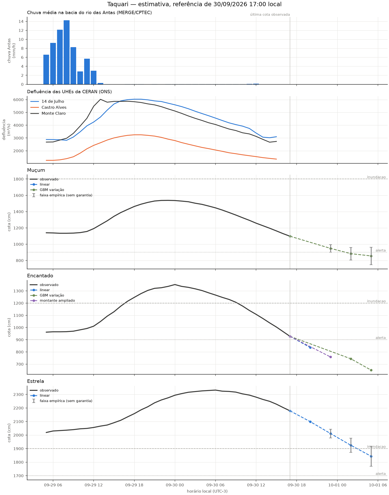

# Revisão da rodada de 30/09/2026 17:00

Modo: **emissao**. Referência observada: 30/09 17:00 (UTC−3). Emissão registrada em 30/09/2026 17:40:28 local. A antecedência real desconta o tempo desde a observação.

Horizontes contados desde a referência da própria estação; chuva e ONS mantêm seus atrasos no treino e na inferência. Alterações de modelo passam por comparação por fase da cheia. A coluna de cota é uma estimativa pontual, não uma cota de pico. Não é sistema de alerta.

| alvo      | motor          |   h | referencia_local   |   observado_cm | previsto_cm   | validade_local   |   antecedencia_real_h | status              |
|:----------|:---------------|----:|:-------------------|---------------:|:--------------|:-----------------|----------------------:|:--------------------|
| Muçum     | linear         |   3 | 30/09 17:00        |           1098 | —             | 30/09 20:00      |                   2.3 | dados_insuficientes |
| Muçum     | gbm_delta      |   6 | 30/09 17:00        |           1098 | 948.5         | 30/09 23:00      |                   5.3 | estimativa          |
| Muçum     | gbm_delta      |   9 | 30/09 17:00        |           1098 | 883.7         | 01/10 02:00      |                   8.3 | estimativa          |
| Muçum     | gbm_delta      |  12 | 30/09 17:00        |           1098 | 855.8         | 01/10 05:00      |                  11.3 | estimativa          |
| Encantado | linear         |   3 | 30/09 17:00        |            928 | 836.0         | 30/09 20:00      |                   2.3 | estimativa          |
| Encantado | ridge_montante |   6 | 30/09 17:00        |            928 | 758.7         | 30/09 23:00      |                   5.3 | estimativa          |
| Encantado | gbm_delta      |   9 | 30/09 17:00        |            928 | 743.8         | 01/10 02:00      |                   8.3 | estimativa          |
| Encantado | gbm_delta      |  12 | 30/09 17:00        |            928 | 650.7         | 01/10 05:00      |                  11.3 | estimativa          |
| Estrela   | linear         |   3 | 30/09 17:00        |           2179 | 2098.8        | 30/09 20:00      |                   2.3 | estimativa          |
| Estrela   | linear         |   6 | 30/09 17:00        |           2179 | 2011.1        | 30/09 23:00      |                   5.3 | estimativa          |
| Estrela   | linear         |   9 | 30/09 17:00        |           2179 | 1924.5        | 01/10 02:00      |                   8.3 | estimativa          |
| Estrela   | linear         |  12 | 30/09 17:00        |           2179 | 1843.4        | 01/10 05:00      |                  11.3 | estimativa          |

## Faixas e diagnóstico

As faixas usam o quantil 90% dos erros de 2025, separado por regime, sem garantia de cobertura. Não são publicadas quando há menos de 30 pares, a velocidade está fora da calibração ou a cobertura dos últimos erros conhecidos cai abaixo de 80% (mínimo três pares nas últimas seis horas). Uma faixa ausente não significa erro zero.

| alvo      |   h | inferior_cm   | superior_cm   | faixa_status              | cobertura_recente_pct   |   n_faixa_recente |
|:----------|----:|:--------------|:--------------|:--------------------------|:------------------------|------------------:|
| Muçum     |   3 | —             | —             | faltam dados              | —                       |                 0 |
| Muçum     |   6 | 902.5         | 994.5         | empírica, sem garantia    | 100.0                   |                 6 |
| Muçum     |   9 | 807.3         | 960.0         | empírica, sem garantia    | 100.0                   |                 6 |
| Muçum     |  12 | 749.2         | 962.3         | empírica, sem garantia    | 100.0                   |                 6 |
| Encantado |   3 | —             | —             | sem calibração            | —                       |                 0 |
| Encantado |   6 | —             | —             | subida fora da calibração | 40.0                    |                 5 |
| Encantado |   9 | —             | —             | subida fora da calibração | 83.3                    |                 6 |
| Encantado |  12 | —             | —             | subida fora da calibração | 83.3                    |                 6 |
| Estrela   |   3 | —             | —             | sem calibração            | —                       |                 0 |
| Estrela   |   6 | 1979.0        | 2043.3        | empírica, sem garantia    | 100.0                   |                 6 |
| Estrela   |   9 | 1872.9        | 1976.1        | empírica, sem garantia    | 100.0                   |                 6 |
| Estrela   |  12 | 1769.8        | 1917.1        | empírica, sem garantia    | 100.0                   |                 6 |

## Replay da subida

Referências a partir de 29/09 17:00; somente alvos já observados. Horizontes maiores têm menos pares. Ausência de linha significa ausência de pares, não erro zero.

| alvo      |   h |   MAE_cm |   vies_cm |   n |
|:----------|----:|---------:|----------:|----:|
| Encantado |   3 |     15.5 |      10.6 |  22 |
| Encantado |   6 |     30.1 |      29.4 |  19 |
| Encantado |   9 |     45.9 |       7.5 |  16 |
| Encantado |  12 |     64.7 |       9.6 |  13 |
| Estrela   |   3 |      6.4 |      -3.4 |  22 |
| Estrela   |   6 |     11.7 |      -6.7 |  19 |
| Estrela   |   9 |     17.1 |      -3.8 |  16 |
| Estrela   |  12 |     20.2 |       2.6 |  13 |
| Muçum     |   3 |     14.7 |      14.7 |  22 |
| Muçum     |   6 |     24.6 |      16.3 |  19 |
| Muçum     |   9 |     27.8 |       3.2 |  16 |
| Muçum     |  12 |     55.9 |      37.5 |  13 |

Os candidatos são escolhidos em 2023–2024, confirmados em 2025 e podem ser vetados por regressão em 2026. A comparação completa está em [melhoria e aceitação](12_melhoria_live.md). O replay assume atrasos fixos e não recompõe a publicação real de cada fonte.

Arquivo local da execução: `data/processed/live_runs/emissao_20260930T204028429793Z`. Contém previsões, replay, features, datasets de treino, código e configuração.

## Emissões reais conferidas

| alvo      |   h |   MAE_cm |   n |
|:----------|----:|---------:|----:|
| Encantado |   3 |     30.9 |  32 |
| Encantado |   6 |    101   |  29 |
| Encantado |   9 |    127   |  27 |
| Encantado |  12 |    169.4 |  24 |
| Estrela   |   3 |     15.5 |  33 |
| Estrela   |   6 |     44.7 |  30 |
| Estrela   |   9 |     90.5 |  27 |
| Estrela   |  12 |    149   |  24 |
| Muçum     |   3 |     47.9 |   5 |
| Muçum     |   6 |    103.9 |  30 |
| Muçum     |   9 |    169.2 |  27 |
| Muçum     |  12 |    228.8 |  24 |
